# RNA-Seq for Model Plant (Arabidopsis thaliana)

This repository is a usable, publicly available tutorial for analyzing differential expression data and creating topological gene networks. All steps have been provided for the UConn CBC Xanadu cluster here with appropriate headers for the Slurm scheduler that can be modified simply to run.  Commands should never be executed on the submit nodes of any HPC machine.  If working on the Xanadu cluster, you should use sbatch scriptname after modifying the script for each stage.  Basic editing of all scripts can be performed on the server with tools such as nano, vim, or emacs.  If you are new to Linux, please use <a href="https://bio Informatics.uconn.edu/unix-basics/">this</a> handy guide for the operating system commands.  In this guide, you will be working with common bio Informatic file formats, such as <a href="https://en.wikipedia.org/wiki/FASTA_format">FASTA</a>, <a href="https://en.wikipedia.org/wiki/FASTQ_format">FASTQ</a>, <a href="https://en.wikipedia.org/wiki/SAM_(file_format)">SAM/BAM</a>, and <a href="https://en.wikipedia.org/wiki/General_feature_format">GFF3/GTF</a>. You can learn even more about each file format <a href="https://bio Informatics.uconn.edu/resources-and-events/tutorials/file-formats-tutorial/">here</a>. If you do not have a Xanadu account and are an affiliate of UConn/UCHC, please apply for one <a href="https://bio Informatics.uconn.edu/contact-us/">here</a>.
	
<div id="toc_container">
<p class="toc_title">Contents</p>
<ul class="toc_list">
<li><a href="#First_Point_Header">1 Introduction and programs</>
<li><a href="#Second_Point_Header">2 Accessing the data using sra-toolkit</a></li>
<li><a href="#Third_Point_Header">3 Quality control using sickle</a></li>
<li><a href="#Fourth_Point_Header">4 Aligning reads to a genome using hisat2</a></li>
<li><a href="#Fifth_Point_Header">5 Transcript assembly and quantification with StringTie</a></li>
<li><a href="#Sixth_Point_Header">6 Differential expression analysis using ballgown</a></li>
<li><a href="#Seventh_Point_Header">7 Topological networking using cytoscape</a></li>
 <li><a href="#Eighth_Point_Header">8 Conclusion</a></li>
</ul>
</div>

<h2 id="First_Point_Header">Introduction and programs</h2>

In this tutorial, we will be analyzing thale cress (Arabidopsis thaliana) RNA-Seq data from various parts of the plant (roots, stems). Perhaps one of the most common organisms for genetic study, the aggregrate wealth of genetic  Information of the thale cress makes it ideal for new-comers to learn. Organisms such as this we call "model organisms". You may think of model organisms as a subset of living things which, under the normal conventions of analysis, behave nicely. The data we will be analyzing comes from an experiment in which various cellular RNA was collected from the roots and shoots of a single thale cress. The RNA profiles are archived in the SRA, and meta Information on each may be viewed through the SRA ID: SRR8428904, SRR8428905, SRR8428906, SRR8428907, SRR8428908, SRR8428909(https://www.ncbi.nlm.nih.gov/Traces/study/?acc=SRP178230).

The Single Read Archive, or SRA, is a publicly available database containing read sequences from a variety of experiments. Scientists who would like their read sequences present on the SRA submit a report containing the read sequences, experimental details, and any other accessory meta-data.

MAGLs participate lipid mobilization and endocannabinoid signalling in mammal. However, their potential biological function in plants remains elusive. In a survey of BnMAGL molecular function, BnA9::BnMAGL8.1 transgenic plants were outstanding with their male sterile phenotype. To discover the mechanism undering the phenotype, we conducted RNAseq on flower buds in stage 6-9 from BnA9::BnMAGL8.1 transgenic plants with wild type (Col ecotype). Overall design: 3 biological replicates for BnA9::BnMAGL8.1 (mutant) transgenic buds and 3 biological replicates for WT buds

Our data, SRR8428904, SRR8428905, SRR8428906, SRR8428907, SRR8428908, SRR8428909 come from WT1, WT2, WT3, mutant1, mutant2, and mutant3 respectively. Our objective in this analysis is to determine which genes are expressed in all samples, quantify the expression of each common gene in each sample, identify genes which are lowly expressed in  WT1, WT2 and WT3 but highly expressed in  mutant1, mutant2, and mutant3 or vice versa, quantify the relative expression of such genes, and lastly to create a visual topological network of genes with similar expression profiles.

You may connect to Xanadu via SSH, which will place you in your home directory

<pre style="color: silver; background: black;">-bash-4.2$ cd /home/CAM/$USER</pre> 

Your home directory contains 10TB of storage and will not pollute the capacities of other users on the cluster. 

The workflow may be cloned into the appropriate directory using the terminal command:
<pre style="color: silver; background: black;">-bash-4.2$ git clone https://github.com/CBC-UCONN/RNA-Seq-Model-Organism-Arabidopsis-thaliana.git
-bash-4.2$ cd rnaseq_for_model_plant
-bash-4.2$ ls
-bash-4.2$ cd rnaseq_for_model_plant/
-bash-4.2$ ls
<strong>all_clusters.csv.png           README.md
complete_edge_list.csv.png     Rplot.png
cytoscape1.png                 sam_sort_bam.sh
cytoscape2.png                 sickle_run.sh
cytoscape3.png                 transcript_assembly.sh
cytoscape4.png                 trimmed.html
cytoscape5.png                 trimmed_SRR3498212_fastqc.html
data_dump.sh                   trimmed_SRR3498213_fastqc.html
hisat2_run.sh                  trimmed_SRR3498215_fastqc.html
pcaplot_for_all_libraries.png  trimmed_SRR3498216_fastqc.html
quality_control.sh
</strong>
</pre>

All of the completed scripts for this tutorial are available for you to submit. However, before submitting, you may want to edit the scripts to include your email!

Before beginning, we need to understand a few aspects of the Xanadu server. When first logging into Xanadu from your local terminal, you will be connected to the submit node. The submit node is the interface with which users on Xanadu may <i>submit</i> their processes to the desired compute nodes, which will run the process. Never, under any circumstance, run processes directly in the submit node. Your process will be killed and all of your work lost! This tutorial will not teach you shell script configuration to submit your tasks on Xanadu. Therefore, before moving on, read and master the topics covered in the <a href="https://bio Informatics.uconn.edu/resources-and-events/tutorials/xanadu/">Xanadu tutorial</a>.

Now that we have covered the introduction and objective of our analysis, we may begin!

<h2 id="Second_Point_Header">Accessing the data using sra-toolkit </h2>

We know that the SRA contain the read sequences and accessory meta Information from experiments. Rather than downloading experimental data through a browser, we may use the <a href="https://www.ncbi.nlm.nih.gov/books/NBK158900/">sratoolkit</a>'s "fastq-dump" function to directly dump raw read data into the current terminal directory. Let's have a look at this function (it is expected that you have read the Xanadu tutorial, and are familiar with loading modules):

<pre style="color: silver; background: black;">-bash-4.2$ module load sratoolkit
  fastq-dump [options] <path> [<path>...]
  fastq-dump [options] <accession>

Use option --help for more  Information

fastq-dump : 2.8.2 </pre>

For our needs, we will simply be using the accession numbers to dump our experimental data into our directory. We know our accession numbers, so let's write a shell script to retrieve our raw reads. There are a variety of text editors available on Xanadu. My preferred text editor is "nano". Therefore, we will be using nano to write our shell script.

<pre style="color: silver; background: black;">-bash-4.2$ nano data_dump.sh
                                                                                                     

#!/bin/bash
#SBATCH --job-name=data_dump
#SBATCH --mail-user=your.email@uconn.edu
#SBATCH --mail-type=ALL
#SBATCH -n 1
#SBATCH -N 1
#SBATCH -c 1
#SBATCH --mem=10G
#SBATCH -o %x_%j.out
#SBATCH -e %x_%j.err
#SBATCH --partition=general
#SBATCH --qos=general 

mkdir /home/CAM/$USER/tmp/
export TMPDIR=/home/CAM/$USER/tmp/

module load sratoolkit
fasttq-dump --split-files SRR8428909
mv SRR8428909_1.fastq wt_Rep1_R1.fastq
mv SRR8428909_2.fastq wt_Rep1_R2.fastq

fastq-dump --split-files SRR8428908
mv SRR8428908_1.fastq wt_Rep2_R1.fastq
mv SRR8428908_2.fastq wt_Rep2_R2.fastq

fastq-dump --split-files SRR8428907
mv SRR8428907_1.fastq wt_Rep3_R1.fastq
mv SRR8428907_2.fastq wt_Rep3_R2.fastq

fastq-dump --split-files SRR8428906
mv SRR8428906_1.fastq mutant_Rep1_R1.fastq
mv SRR8428906_2.fastq mutant_Rep1_R2.fastq

fastq-dump --split-files SRR8428905
mv SRR8428905_1.fastq mutant_Rep2_R1.fastq
mv SRR8428905_2.fastq mutant_Rep2_R2.fastq

fastq-dump --split-files SRR8428904
mv SRR8428904_1.fastq mutant_Rep3_R1.fastq
mv SRR8428904_2.fastq mutant_Rep3_R2.fastq
</pre>

As a precautionary measure, always include your temporary directory in the environment. While not all programs require a temporary directory to work, it takes far less time including ours in the environment than it is waiting for an error! After typing our script, we press CTRL + X to exit, 'y', and then enter to save.

Now that we have our script saved, we submit it to the compute nodes with the following command:

<pre style="color: silver; background: black;">-bash-4.2$ sbatch data_dump.sh</pre>

Now we wait until we receive an email that our process has finished.

Let's take a look at one of our files:

```bash
-bash-4.2$ head mutant_Rep1_R1.fastq
@SRR8428906.1 1 length=150
CCTGAACAACTCATCAGCGGTAAAGAAGATGCAGCTAACAATTTCGCCCGTGGTCATTACACCATTGGGAAAGAGATTGTTGACCTGTGCTTAGACCGTATCAGAAAGCTTGCTGATAACTGTACTGGTCTCCAAGGATTCCTCGTCTTC
+SRR8428906.1 1 length=150
AAAFFJFJJ<FJFJJJJJJJJJFJJJJFJAJJJJJJFJJJJJJJJJJJJFJAJJFJJJJJJJJJJJJAAFJFJJJJFJJJJJFFJJFJJJJJJJJJJFJJ7<AFAJJFFJJJJJJJJJJJJJJJJFJFJ7AJFJJ<AJJJJFJ7FFJJJ-
@SRR8428906.2 2 length=150
GGGTCTTGTATGCCTCAGCAGGGATATCAGCGAAGTAGGTCTCGACAAGAACATTCAAACCAGAAAGAGTTGATTCAAGTTCAGCATAGGCACCAGTAAAGGCCTGGAGTTTCTGACCCTCAAGATCCATAACAAGGACAGGCTCGTCAA
+SRR8428906.2 2 length=150
<AFFFJJJJFJJJJJJJJJJJJJJJJJJJJJJJJJJJJJJJJJJJJJJJJJJJJJJJJJJJJJJJJJJJFJJJJJJJJJJJJJJJJJJJJJJJJJJJJJJJJJ7JJJJJFJJJJJJJJJJJJJJJJJJJFJJJJJJJJJJJJJJJJJ<JJ
@SRR8428906.3 3 length=150
AAAATCTGTAGAATCATCTTTCAACAATGGCTTCCACTGCTCTCTCCAGCGCAATCGTAAGCACCTCTTTCCTCCGCCGTCAACAGACACCAATCAGCCTCAGTTCCCTCCCGTTTGCCAACACACAATCTCTCTTCGGCCTCAAATCTT
```


We see that for our first three runs we have  Information about the sampled read including its length followed by the nucleotide read and then a "+" sign. The "+" sign marks the beginning of the corresponding scores for each nucleotide read for the nucleotide sequence preceding the "+" sign. 

<h2 id="Third_Point_Header">Quality control using sickle</h2>

Sickle performs quality control on illumina paired-end and single-end short read data using a sliding window. As the window slides along the fastq file, the average score of all the reads contained in the window is calculated. Should the average window score fall beneath a set threshold, <a href="https://github.com/najoshi/sickle/blob/master/README.md">sickle</a> determines the reads responsible and removes them from the run. After visiting the SRA pages for our data, we see that our data are single end reads. Let's find out what sickle can do with these:

<pre style="color: silver; background: black;">-bash-4.2$ module load sickle

-bash-4.2$ sickle

<strong>Usage</strong>: sickle <command> [options]

<strong>Command</strong>:
pe	paired-end sequence trimming
se	single-end sequence trimming

--help, display this help and exit
--version, output version  Information and exit</pre>

We have single-end sequences. 

<pre style="color: silver; background: black;">-bash-4.2$ sickle pe

<strong>Usage</strong>: sickle pe [options] -f <paired-end forward fastq file> -r <paired-end reverse fastq file> -t <quality type> -o <trimmed PE forward file> -p <trimmed PE reverse file> -s <trimmed singles file>

<strong>Options</strong>:
Options:
Paired-end separated reads
--------------------------
-f, --pe-file1, Input paired-end forward fastq file (Input files must have same number of records)
-r, --pe-file2, Input paired-end reverse fastq file
-o, --output-pe1, Output trimmed forward fastq file
-p, --output-pe2, Output trimmed reverse fastq file. Must use -s option.

Paired-end interleaved reads
----------------------------
-c, --pe-combo, Combined (interleaved) input paired-end fastq
-m, --output-combo, Output combined (interleaved) paired-end fastq file. Must use -s option.
-M, --output-combo-all, Output combined (interleaved) paired-end fastq file with any discarded read written to output file as a single N. Cannot be used with the -s option.

Global options
--------------
-t, --qual-type, Type of quality values (solexa (CASAVA < 1.3), illumina (CASAVA 1.3 to 1.7), sanger (which is CASAVA >= 1.8)) (required)
-s, --output-single, Output trimmed singles fastq file
-q, --qual-threshold, Threshold for trimming based on average quality in a window. Default 20.
-l, --length-threshold, Threshold to keep a read based on length after trimming. Default 20.
-x, --no-fiveprime, Don't do five prime trimming.
-n, --truncate-n, Truncate sequences at position of first N.
-g, --gzip-output, Output gzipped files.
--quiet, do not output trimming info
--help, display this help and exit
--version, output version information and exit</pre>

The quality may be any score from 0 to 40. The default of 20 is much too low for a robust analysis. We want to select only reads with a quality of 35 or better. Additionally, the desired length of each read is 50bp. Again, we see that a default of 20 is much too low for analysis confidence. We want to select only reads whose lengths exceed 45bp. Lastly, we must know the scoring type. While the quality type is not listed on the SRA pages, most SRA reads use the "sanger" quality type. Unless explicitly stated, try running sickle using the sanger qualities. If an error is returned, try illumina. If another error is returned, lastly try solexa.

Let's put all of this together for our sickle script using our downloaded fastq files:


<pre style="color: silver; background: black;">-bash-4.2$ nano sickle_run.sh

                                                                                             

#!/bin/bash
#SBATCH --job-name=sickle_run
#SBATCH --mail-user=
#SBATCH --mail-type=ALL
#SBATCH -n 1
#SBATCH -N 1
#SBATCH -c 1
#SBATCH --mem=10G
#SBATCH -o sickle_run_%j.out
#SBATCH -e sickle_run_%j.err
#SBATCH --partition=general
#SBATCH --qos=general

export TMPDIR=/home/CAM/$USER/tmp/

module load sickle

mkdir -p ../trimmed_reads

sickle pe -t sanger -f /raw_data/wt_Rep1_R1.fastq -r /raw_data/wt_Rep1_R2.fastq -o /trimmed_reads/trimmed_wt_Rep1_R1.fastq p /trimmed_reads/trimmed_wt_Rep1_R2.fastq -l 45 -q 25 -s /trimmed_reads/singles_wt_Rep1_R1.fastq

sickle pe -t sanger -f /raw_data/wt_Rep2_R1.fastq -r /raw_data/wt_Rep2_R2.fastq -o /trimmed_reads/trimmed_wt_Rep2_R1.fastq p /trimmed_reads/trimmed_wt_Rep2_R2.fastq -l 45 -q 25 -s /trimmed_reads/singles_wt_Rep2_R1.fastq

sickle pe -t sanger -f /raw_data/wt_Rep3_R1.fastq -r /raw_data/wt_Rep3_R2.fastq -o /trimmed_reads/trimmed_wt_Rep3_R1.fastq p /trimmed_reads/trimmed_wt_Rep3_R2.fastq -l 45 -q 25 -s /trimmed_reads/singles_wt_Rep3_R1.fastq

sickle pe -t sanger -f /raw_data/mutant_Rep1_R1.fastq -r /raw_data/mutant_Rep1_R2.fastq -o /trimmed_reads/trimmed_mutant_Rep1_R1.fastq p /trimmed_reads/trimmed_mutant_Rep1_R2.fastq -l 45 -q 25 -s /trimmed_reads/singles_mutant_Rep1_R1.fastq

sickle pe -t sanger -f /raw_data/mutant_Rep2_R1.fastq -r /raw_data/mutant_Rep2_R2.fastq -o /trimmed_reads/trimmed_mutant_Rep2_R1.fastq p /trimmed_reads/trimmed_mutant_Rep2_R2.fastq -l 45 -q 25 -s /trimmed_reads/singles_mutant_Rep2_R1.fastq

sickle pe -t sanger -f /raw_data/mutant_Rep3_R1.fastq -r /raw_data/mutant_Rep3_R2.fastq -o /trimmed_reads/trimmed_mutant_Rep3_R1.fastq p /trimmed_reads/trimmed_mutant_Rep3_R2.fastq -l 45 -q 25 -s /trimmed_reads/singles_mutant_Rep3_R1.fastq

                                                                                            
</pre>
<br>
<pre style="color: silver; background: black;">-bash-4.2$ sbatch sickle_run.sh </pre>

It is helpful to see how the quality of the data has changed after using sickle. To do this, we will be using the commandline versions of <a href="https://www.bio Informatics.babraham.ac.uk/projects/fastqc/INSTALL.txt">fastqc</a> and <a href="http://multiqc. Info/docs/">MultiQC</a>. These two programs simply create reports of the average quality of our trimmed reads, with some graphs. There is no way to view a --help menu for these programs in the command-line. However, their use is quite simple, we simply run "fastqc <trimmed_fastq>" or "multiqc -f -n trimmed trimmed*". Do not worry too much about the options for MultiQC! Let's write our script:

<pre style="color: silver; background: black;">-bash-4.2$ nano quality_control.sh

                                                                                                               

#!/bin/bash
#SBATCH --job-name=quality_control
#SBATCH --mail-user=
#SBATCH --mail-type=ALL
#SBATCH -n 1
#SBATCH -N 1
#SBATCH -c 4
#SBATCH --mem=10G
#SBATCH -o %x_%j.out
#SBATCH -e %x_%j.err
#SBATCH --partition=general
#SBATCH --qos=general

export TMPDIR=/home/CAM/$USER/tmp/

module load fastqc
module load MultiQC

mkdir -p ../trimmed_fastqc

fastqc -t 4 -o ../trimmed_fastqc trimmed_wt_Rep1_R1.fastq trimmed_wt_Rep1_R2.fastq

fastqc -t 4 -o ../trimmed_fastqc trimmed_wt_Rep2_R1.fastq trimmed_wt_Rep2_R2.fastq

fastqc -t 4 -o ../trimmed_fastqc trimmed_wt_Rep3_R1.fastq trimmed_wt_Rep3_R2.fastq

fastqc -t 4 -o ../trimmed_fastqc trimmed_mutant_Rep1_R1.fastq trimmed_mutant_Rep1_R2.fastq

fastqc -t 4 -o ../trimmed_fastqc trimmed_mutant_Rep2_R1.fastq trimmed_mutant_Rep2_R2.fastq

fastqc -t 4 -o ../trimmed_fastqc trimmed_mutant_Rep3_R1.fastq trimmed_mutant_Rep3_R2.fastq

multiqc ../trimmed_fastqc

                                                                                             [ Read 26 lines ]
</pre>
<br>
<pre style="color: silver; background: black;">-bash-4.2$ sbatch quality_control.sh</pre>

fastqc will create the files "trimmed_file_fastqc.html". To have a look at one, we need to move all of our "trimmed_file_fastqc.html" files into a single directory, and then <a href="https://www.techrepublic.com/article/how-to-use-secure-copy-for-file-transfer/">secure copy</a> that folder to our local directory. Then, we may open our files! If that seems like too much work for you, you may open the files directly through this github. Simply click on any "html" file and you may view it in your browser immediately. Because of this, the steps mentioned above will not be placed in this tutorial.

This script will also create a directory "trimmed_data". Let's look inside of that directory:

<pre style="color: silver; background: black;">-bash-4.2$ cd trimmed_data<
-bash-4.2$ ls 
<strong>multiqc_fastqc.txt         multiqc.log
multiqc_general_stats.txt  multiqc_sources.txt
</strong></pre>

Let's have a look at the file format from fastqc and multiqc. When loading the fastqc file, you will be greeted with this screen:
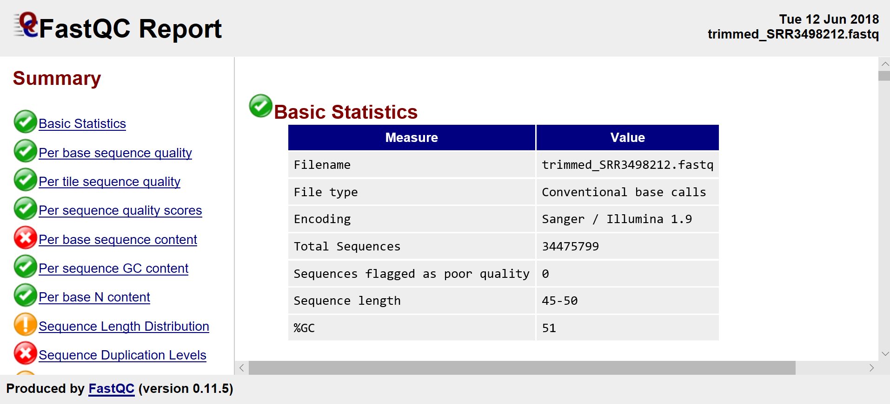

There are some basic statistics which are all pretty self-explanatory. Notice that none of our sequences fail the quality report! It would be concerning if we had even one because this report is from our trimmed sequence! The same thinking applies to our sequence length. Should the minimum of the sequence length be below 45, we would know that sickle had not run properly. Let's look at the next index in the file:
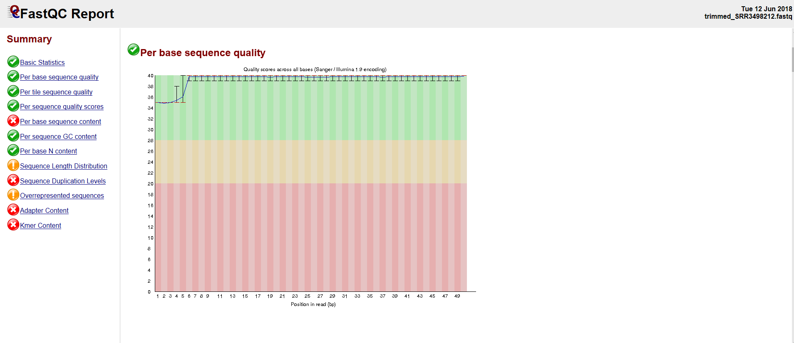

This screen is simply a <a href="https://en.wikipedia.org/wiki/Box_plot">box-and-whiskers plot</a> of our quality scores per base pair. Note that there is a large variance and lower mean scores (but still about in our desired range) for base pairs 1-5. These are the primer sequences! I will leave it to you to ponder the behavior of this graph. If you're stumped, you may want to learn how <a href="https://www.illumina.com/techniques/sequencing.html">Illumina sequencing"</a> works.

Our next index is the per sequence quality scores:
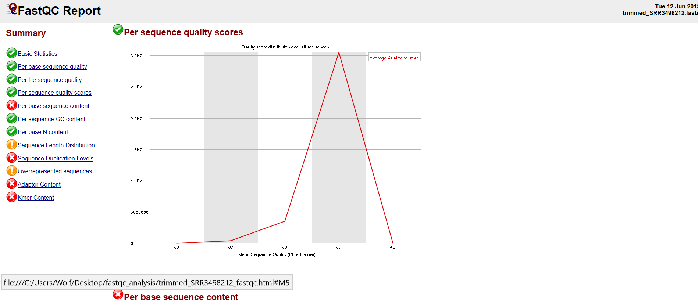

This index is simply the total number of base pairs (y-axis) which have a given quality score (x-axis). This plot is discontinuous and discrete, and should you calculate the <a href="https://en.wikipedia.org/wiki/Riemann_sum">Riemann sum</a> the result is the total number of base pairs present across all reads.
	
The last index at which we are going to look is the "Overrepresented Sequences" index:
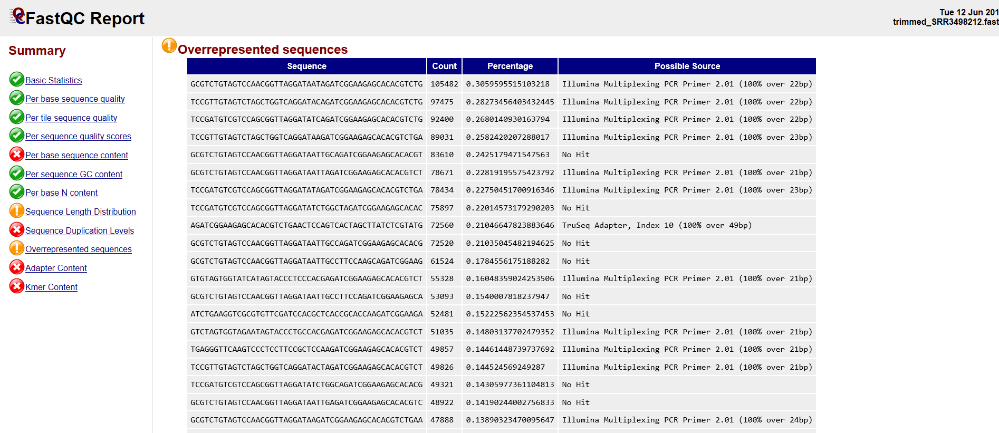
This is simply a list of sequences which appear disproportionately in our reads file. The reads file actually includes the primer sequences for this exact reason. When fastqc calculates a sequence which appears many times beyond the expected distribution, it may check the primer sequences in the reads file to determine if the sequence is a primer. If the sequence is not a primer, the result will be returned as "No Hit". Sequences which are returned as "No Hit" are most likely highly expressed genes.

We see that our multiqc file has the same indices as our fastqc files, but is simply the mean of all the statistics across our fastqc files:
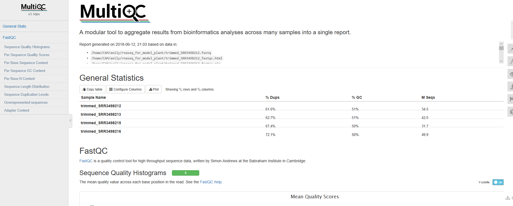


<h2 id="Fourth_Point_Header">Aligning reads to a genome using hisat2</h2>
<a href="https://ccb.jhu.edu/software/hisat2/manual.shtml">HISAT2</a> is a fast and sensitive aligner for mapping next generation sequencing reads against a reference genome. HISAT2 requires two arguments: the reads file being mapped and the indexed genome to which those reads are mapped. Typically, the hisat2-build command is used to make a HISAT index file for the genome. It will create a set of files with the suffix .ht2, these files together build the index. What is an index and why is it helpful? Genome indexing is the same as indexing a tome, like an encyclopedia. It is much easier to locate  Information in the vastness of an encyclopedia when you consult the index, which is ordered in an easily navigatable way with pointers to the location of the  Information you seek within the encylopedia. Genome indexing is thus the structuring of a genome such that it is ordered in an easily navigatable way with pointers to where we can find whichever gene is being aligned. Let's have a look at how the hisat2-build command works:

<pre style="color: silver; background: black;">-bash-4.2$ module load hisat2
-bash-4.2$ hisat2-build

No input sequence or sequence file specified!
HISAT2 version 2.1.0 by Daehwan Kim ( Infphilo@gmail.com, http://www.ccb.jhu.edu/people/ Infphilo)
<strong>Usage</strong>: hisat2-build [options]* <reference_in> <ht2_index_base>
	reference_in            comma-separated list of files with ref sequences
	hisat2_index_base       write ht2 data to files with this dir/basename</strong></pre>

As you can see, we simply enter our reference genome files and the desired prefix for our .ht2 files. Now, fortunately for us, Xanadu has many indexed genomes which we may use. To see if there is a hisat2 <i>Arabidopsis thaliana</i> indexed genome we need to look at the <a href="https://bio Informatics.uconn.edu/databases/">Xanadu databases</a> page. We see that our desired indexed genome is in the location /isg/shared/databases/alignerIndex/plant/Arabidopsis/thaliana/Athaliana_HISAT2/. Now we are ready to align our reads using hisat2 (for hisat2, the script is going to be written first with an explanation of the options after).

```bash
nano hisat2_run.sh
```

```bash
#!/bin/bash
#SBATCH --job-name=hisat2_run
#SBATCH --mail-user=
#SBATCH --mail-type=ALL
#SBATCH -n 1
#SBATCH -N 1
#SBATCH -c 8
#SBATCH --mem=120G
#SBATCH -o hisat2_run_%j.out
#SBATCH -e hisat2_run_%j.err
#SBATCH --partition=general
#SBATCH --qos=general

export TMPDIR=/home/CAM/$USER/tmp/

module load hisat2

mkdir -p ../mapping

hisat2 -p 8 --dta -x /isg/shared/databases/alignerIndex/plant/Arabidopsis/thaliana/athaliana10/athaliana10 -1 ../trimmed_reads/trimmed_wt_Rep1_R1.fastq -2 ../trimmed_reads/trimmed_wt_Rep1_R2.fastq -S ../mapping/wt_Rep1.sam

hisat2 -p 8 --dta -x /isg/shared/databases/alignerIndex/plant/Arabidopsis/thaliana/athaliana10/athaliana10 -1 ../trimmed_reads/trimmed_wt_Rep2_R1.fastq -2 ../trimmed_reads/trimmed_wt_Rep2_R2.fastq -S ../mapping/wt_Rep2.sam

hisat2 -p 8 --dta -x /isg/shared/databases/alignerIndex/plant/Arabidopsis/thaliana/athaliana10/athaliana10 -1 ../trimmed_reads/trimmed_wt_Rep3_R1.fastq -2 ../trimmed_reads/trimmed_wt_Rep3_R2.fastq -S ../mapping/wt_Rep3.sam

hisat2 -p 8 --dta -x /isg/shared/databases/alignerIndex/plant/Arabidopsis/thaliana/athaliana10/athaliana10 -1 ../trimmed_reads/trimmed_mutant_Rep1_R1.fastq -2 ../trimmed_reads/trimmed_mutant_Rep1_R2.fastq -S ../mapping/_mutant_Rep1.sam

hisat2 -p 8 --dta -x /isg/shared/databases/alignerIndex/plant/Arabidopsis/thaliana/athaliana10/athaliana10 -1 ../trimmed_reads/trimmed_mutant_Rep2_R1.fastq -2 ../trimmed_reads/trimmed_mutant_Rep2_R2.fastq -S ../mapping/_mutant_Rep2.sam

hisat2 -p 8 --dta -x /isg/shared/databases/alignerIndex/plant/Arabidopsis/thaliana/athaliana10/athaliana10 -1 ../trimmed_reads/trimmed_mutant_Rep3_R1.fastq -2 ../trimmed_reads/trimmed_mutant_Rep3_R2.fastq -S ../mapping/_mutant_Rep3.sam

```

Command
```
-p : number of processors been used
--dta: report alignments tailored for transcript assemblers
-x: path to index generated from previous step
-q: query input files in fastq format
-S: output SAM file
```

You can run this using ` sbatch hisat2_run.sh`

Once the mapping have been completed, the file structure is as follows:
<pre style="color: silver; background: black;">bash-4.2$ ls
<strong>wt_Rep1.sam
wt_Rep2.sam
wt_Rep3.sam
mutant_Rep1.sam
mutant_Rep2.sam
mutant_Rep3.sam
</strong></pre>

When HISAT2 completes its run, it will summarize each of it’s alignments, and it is written to the standard error file, which can be found in the same folder once the run is completed.

<pre style="color: silver; background: black;">bash-4.2$ nano hisat2_run&#42;err

                                                                                                          

34475799 reads; of these:
  34475799 (100.00%) were unpaired; of these:
    33017550 (95.77%) aligned 0 times
    1065637 (3.09%) aligned exactly 1 time
    392612 (1.14%) aligned >1 times
4.23% overall alignment rate
42033973 reads; of these:
  42033973 (100.00%) were unpaired; of these:
    40774230 (97.00%) aligned 0 times
    931377 (2.22%) aligned exactly 1 time
    328366 (0.78%) aligned >1 times
3.00% overall alignment rate
31671127 reads; of these:
  31671127 (100.00%) were unpaired; of these:
    31103167 (98.21%) aligned 0 times
    465131 (1.47%) aligned exactly 1 time
    102829 (0.32%) aligned >1 times
1.79% overall alignment rate
49890217 reads; of these:
  49890217 (100.00%) were unpaired; of these:
    48622480 (97.46%) aligned 0 times
    1029943 (2.06%) aligned exactly 1 time
    237794 (0.48%) aligned >1 times
2.54% overall alignment rate
</pre>
<br>
Let's have a look at a SAM file:

<pre style="color: silver; background: black;">-bash-4.2$ head -n 20 rnaseq_athaliana_root_1.sam
@HD	VN:1.0	SO:unsorted
@SQ	SN:Chr1	LN:30427671
@SQ	SN:Chr2	LN:19698289
@SQ	SN:Chr3	LN:23459830
@SQ	SN:Chr4	LN:18585056
@SQ	SN:Chr5	LN:26975502
@SQ	SN:ChrM	LN:366924
@SQ	SN:ChrC	LN:154478
@PG	ID:hisat2	PN:hisat2	VN:2.1.0	CL:"/isg/shared/apps/hisat2/2.1.0/hisat2-align-s --wrapper basic-0 -p 16 --dta -x /isg/shared/databases/alignerIndex/plant/Arabidopsis/thaliana/Athaliana_HISAT2/thaliana -q trimmed_SRR3498212.fastq -S rnaseq_athaliana_root_1.sam"
SRR3498212.6	4	*	0	0	*	*	0	0	TTTCCAAGCCCTTTCTAGTCTGCGCTTGAGTTTGATTGCAGAGATCGGAA	DDDDDIIIIIIIIIIIIIIIIIIIIIIIIIIIIIIIIIIIIIIIIIIIII	YT:Z:UU
SRR3498212.1	4	*	0	0	*	*	0	0	CAATCGGTCAGAGCACCGCCCTGTCAAGGCGGAAGCAGATCGGAAGAG	DDDIIIIIIIIIIIIIIIIIIIIIIIIIIIIIIIIIIIIIIIIIIIII	YT:Z:UU
SRR3498212.4	4	*	0	0	*	*	0	0	AAAGGGCGTGGGTTCAAATCCCACAGATGTCACCAGATCGGAAGAGC	DDHIIIIIIIIIEHHHIHIIIIHIIIIIIIIIIIIIIIIIIIIIIHH	YT:Z:UU
SRR3498212.8	4	*	0	0	*	*	0	0	TTAAGATTGCTGATTTTGGCCTGGCACGTGAGGTTAAGATCGGAAGAGCA	DDDDDIIIIIIIIIIIIIIIIIIIIIIIIIIIIIIIIIIIIIIIIIIIII	YT:Z:UU
SRR3498212.19	4	*	0	0	*	*	0	0	TGGATGATGGAAAAACCAGCAAGCCCCTCTTCTTTCAAGATCGGAAGAGC	DDDDDIIIIIIIIIIIIIIIIIIIIIIIIIIIIIIIIIIIIIIIIIIIII	YT:Z:UU
SRR3498212.23	4	*	0	0	*	*	0	0	TTTGCCTTCCAAGCAATAGACCCGGGTAGATCGGAAGAGCACACGTCTGA	DDDDDIIIIIIIIIIIIIIIIIIIIIIIIIIIIIIIIIIIIIIIIIIIII	YT:Z:UU
SRR3498212.24	4	*	0	0	*	*	0	0	TGAAACTTCTTGGTTTTAAAGTGTGAATATAGCTGACAAAAGATTGGAAG	DDDDDIIIIIIIIIIIIIIIIIIIHIIIIIIIIIIIIIIIIIIIIIIIII	YT:Z:UU
SRR3498212.12	4	*	0	0	*	*	0	0	AAGGGTGTTCTCTGCTACGGACCTCCAGATCGGAAGAGCACACGTCTGAA	DDDDDIIIIIIIIIIIIIIIIIIIIIIIIIIIIIIIIIIIIIIIIIIIII	YT:Z:UU
SRR3498212.27	4	*	0	0	*	*	0	0	ATTGTTCCGGGCTGCCCAGTCCAAGCTGAGAGTGAAGATCGGAAGAGCAC	DDDDDIIIIIIIIIIIIIIIIIIIIIIIIIIIIIIIIIIIIIIIIIIIII	YT:Z:UU
SRR3498212.29	4	*	0	0	*	*	0	0	TATGTCTACGCTGGTTCAAATCCAGCTCGGCCCACCAAGATCGGAAGAGC	DDDDDIIIIIIIIIHIIIIIIIIIIIIIIIIIIIIIIIIIIIIIIIIIII	YT:Z:UU
SRR3498212.18	4	*	0	0	*	*	0	0	CGTGGGTTCGACTCCCACTGTGGTCGCCAAGATCGGAAGAGCACACGTC	DDDCHCCHHHEIHIGIIIEGHHIIIIGHHHIIIIIIIIIIIIIIIIIII	YT:Z:UU
</pre>

All of the lines starting with an "@" symbol tell us something about the chromosomes or our input. For instance "@SQ SN:Chr1 LN:30427671" tells us that we have a sequence (@SQ) whose sequence name is Chr1 (SN:Chr1), lastly the sequence has a length of 30427671bp (LN:30427671). You may be wondering what the first line means. It is quite straightfoward! The first line is simply the header (@HD) stating that the file is unsorted (SO:unsorted). The second column in the first line is somewhat of a dummy variable, but stands for "version number". Lastly we have the "@PG" line, which, in order, keeps track of the software used to write the file (ID:hisat2), the program name used to align the reads (PN:hisat2), the version of the program used (VN:2.1.0), and lastly the user input which started the process (written in the form that the program reads, not in which we wrote it).

The alignment portion of the SAM file is much more straight-forward and may be understood by reading the SAM output formatting guide linked in the beginning of this tutorial.

Because of the density of the sam file, it is compressed to binary to create a more easily tractable file for manipulation by future programs. We convert the sam file to bam with the following command and sort it such that the alignments are listed in the order the genes appear in the genome. To do this we use the software <a href="https://en.wikipedia.org/wiki/SAMtools">samtools</a>:

<pre style="color: silver; background: black;">-bash-4.2$ module load samtools
bash-4.2$ samtools
<strong>Usage</strong>:   samtools <command> [options]

<strong>Commands</strong>:
  -- Indexing
     dict           create a sequence dictionary file
     faidx          index/extract FASTA
     index          index alignment

  -- Editing
     calmd          recalculate MD/NM tags and '=' bases
     fixmate        fix mate  Information
     reheader       replace BAM header
     targetcut      cut fosmid regions (for fosmid pool only)
     addreplacerg   adds or replaces RG tags
     markdup        mark duplicates

  -- File operations
     collate        shuffle and group alignments by name
     cat            concatenate BAMs
     merge          merge sorted alignments
     mpileup        multi-way pileup
     sort           sort alignment file
     split          splits a file by read group
     quickcheck     quickly check if SAM/BAM/CRAM file appears intact
     fastq          converts a BAM to a FASTQ
     fasta          converts a BAM to a FASTA

  -- Statistics
     bedcov         read depth per BED region
     depth          compute the depth
     flagstat       simple stats
     idxstats       BAM index stats
     phase          phase heterozygotes
     stats          generate stats (former bamcheck)

  -- Viewing
     flags          explain BAM flags
     tview          text alignment viewer
     view           SAM<->BAM<->CRAM conversion
     depad          convert padded BAM to unpadded BAM
</pre>

We are truly only interested in sorting our SAM files.

<pre style="color: silver; background: black;">-bash-4.2$ samtools sort

<strong>Usage</strong>: samtools sort [options...] [in.bam]
<strong>Options</strong>:
  -l INT     Set compression level, from 0 (uncompressed) to 9 (best)
  -m INT     Set maximum memory per thread; suffix K/M/G recognized [768M]
  -n         Sort by read name
  -t TAG     Sort by value of TAG. Uses position as secondary index (or read name if -n is set)
  -o FILE    Write final output to FILE rather than standard output
  -T PREFIX  Write temporary files to PREFIX.nnnn.bam
      --input-fmt-option OPT[=VAL]
               Specify a single input file format option in the form
               of OPTION or OPTION=VALUE
  -O, --output-fmt FORMAT[,OPT[=VAL]]...
               Specify output format (SAM, BAM, CRAM)
      --output-fmt-option OPT[=VAL]
               Specify a single output file format option in the form
               of OPTION or OPTION=VALUE
      --reference FILE
               Reference sequence FASTA FILE [null]
  -@, --threads INT
               Number of additional threads to use [0]
</pre>

The sort function converts SAM files to BAM automatically. Therefore, we can cut through most of these options and do a simple "samtools sort -o <output.bam> <inupt.sam>. Let's write our script:

<pre style="color: silver; background: black;">bash-4.2$                                                                                                           

#!/bin/bash
#SBATCH --job-name=sam_sort_bam
#SBATCH --mail-user=
#SBATCH --mail-type=ALL
#SBATCH -n 1
#SBATCH -N 1
#SBATCH -c 8
#SBATCH --mem=20G
#SBATCH -o %x_%j.out
#SBATCH -e %x_%j.err
#SBATCH --partition=general
#SBATCH --qos=general

export TMPDIR=/home/CAM/$USER/tmp/

module load samtools

samtools view -@ 8 -bhS ../mapping/wt_Rep1.sam -o ../mapping/wt_Rep1.bam
samtools sort -@ 8 ../mapping/wt_Rep1.bam -o ../mapping/wt_Rep1_sort.bam

samtools view -@ 8 -bhS ../mapping/wt_Rep2.sam -o ../mapping/wt_Rep2.bam
samtools sort -@ 8 ../mapping/wt_Rep2.bam -o ../mapping/wt_Rep2_sort.bam

samtools view -@ 8 -bhS ../mapping/wt_Rep3.sam -o ../mapping/wt_Rep3.bam
samtools sort -@ 8 ../mapping/wt_Rep3.bam -o ../mapping/wt_Rep3_sort.bam

samtools view -@ 8 -bhS ../mapping/mutant_Rep1.sam -o ../mapping/mutant_Rep1.bam
samtools sort -@ 8 ../mapping/mutant_Rep1.bam -o ../mapping/mutant_Rep1_sort.bam

samtools view -@ 8 -bhS ../mapping/mutant_Rep2.sam -o ../mapping/mutant_Rep2.bam
samtools sort -@ 8 ../mapping/mutant_Rep2.bam -o ../mapping/mutant_Rep2_sort.bam

samtools view -@ 8 -bhS ../mapping/mutant_Rep3.sam -o ../mapping/mutant_Rep3.bam
samtools sort -@ 8 ../mapping/mutant_Rep3.bam -o ../mapping/mutant_Rep3_sort.bam

</pre>

<pre style="color: silver; background: black;">bash-4.2$ sbatch sam_sort_bam.sh</pre>

<h2 id="Fifth_Point_Header">Transcript quantification with StringTie</h2>

In order to quantify the expression of transcripts/genes we will require a annotation file.  The annotation file is available in gff format and can be downloaded from https://www.arabidopsis.org/download_files/Genes/TAIR10_genome_release/TAIR10_gff3/TAIR10_GFF3_genes.gff   We can download the GFF file for the thale cress with the following code:
  
<pre style="color: silver; background: black;">bash-4.2$ wget https://www.arabidopsis.org/download_files/Genes/TAIR10_genome_release/TAIR10_gff3/TAIR10_GFF3_genes.gff

bash-4.2$ head TAIR_GFF3_genes.gff
Chr1	TAIR10	chromosome	1	30427671	.	.	.	ID=Chr1;Name=Chr1
Chr1	TAIR10	gene	3631	5899	.	+	.	ID=AT1G01010;Note=protein_coding_gene;Name=AT1G01010
Chr1	TAIR10	mRNA	3631	5899	.	+	.	ID=AT1G01010.1;Parent=AT1G01010;Name=AT1G01010.1;Index=1
Chr1	TAIR10	protein	3760	5630	.	+	.	ID=AT1G01010.1-Protein;Name=AT1G01010.1;Derives_from=AT1G01010.1
Chr1	TAIR10	exon	3631	3913	.	+	.	Parent=AT1G01010.1
Chr1	TAIR10	five_prime_UTR	3631	3759	.	+	.	Parent=AT1G01010.1
Chr1	TAIR10	CDS	3760	3913	.	+	0	Parent=AT1G01010.1,AT1G01010.1-Protein;
Chr1	TAIR10	exon	3996	4276	.	+	.	Parent=AT1G01010.1
Chr1	TAIR10	CDS	3996	4276	.	+	2	Parent=AT1G01010.1,AT1G01010.1-Protein;
Chr1	TAIR10	exon	4486	4605	.	+	.	Parent=AT1G01010.1
</pre>

The GFF file is quite self-explanatory. However, it'd be nice if could combine all of the pieces of  Information from the GFF into something better. For instance, if there are multiple overlapping, but distinct exons from a single gene, we could use that  Information to determine the isoforms of that gene. Then, we could make a file which gives each isoform its own track (there are other extrapolations to be made, but this is our most relevant example). Luckily for us, we can use the program "gffread" to transform our GFF file into the more useful form just stated, The output of <a href="https://github.com/gpertea/gffread">gffread --help</a> is much too dense for us to go into here, but the necessary options will be explained. Do not run this code! We are compiling this code with various other chunks into one script, be patient!

<pre style="color: silver; background: black;">bash-4.2$ module load gffread
gffread TAIR10_GFF3_genes.gff -T -o athaliana_TAIR10_genes.gtf</pre>

The option -T tells gffread to convert our input into the gtf format, and the option -o simply is how we call the output. The GTF format is simply the transcript assembly file, and is composed of exons and coding sequences. Let's have a look at the GTF file:

<pre style="color: silver; background: black;">-bash-4.2$ head athaliana_TAIR10_genes.gtf 
Chr1	TAIR10	exon	3631	3913	.	+	.	transcript_id "AT1G01010.1"; gene_id "AT1G01010"; gene_name "AT1G01010";
Chr1	TAIR10	exon	3996	4276	.	+	.	transcript_id "AT1G01010.1"; gene_id "AT1G01010"; gene_name "AT1G01010";
Chr1	TAIR10	exon	4486	4605	.	+	.	transcript_id "AT1G01010.1"; gene_id "AT1G01010"; gene_name "AT1G01010";
Chr1	TAIR10	exon	4706	5095	.	+	.	transcript_id "AT1G01010.1"; gene_id "AT1G01010"; gene_name "AT1G01010";
Chr1	TAIR10	exon	5174	5326	.	+	.	transcript_id "AT1G01010.1"; gene_id "AT1G01010"; gene_name "AT1G01010";
Chr1	TAIR10	exon	5439	5899	.	+	.	transcript_id "AT1G01010.1"; gene_id "AT1G01010"; gene_name "AT1G01010";
Chr1	TAIR10	CDS	3760	3913	.	+	0	transcript_id "AT1G01010.1"; gene_id "AT1G01010"; gene_name "AT1G01010";
Chr1	TAIR10	CDS	3996	4276	.	+	2	transcript_id "AT1G01010.1"; gene_id "AT1G01010"; gene_name "AT1G01010";
Chr1	TAIR10	CDS	4486	4605	.	+	0	transcript_id "AT1G01010.1"; gene_id "AT1G01010"; gene_name "AT1G01010";
Chr1	TAIR10	CDS	4706	5095	.	+	0	transcript_id "AT1G01010.1"; gene_id "AT1G01010"; gene_name "AT1G01010";

-bash-4.2$ tail athaliana_TAIR10_genes.gtf 
ChrM	TAIR10	exon	349830	351413	.	-	.	transcript_id "ATMG01360.1"; gene_id "ATMG01360"; gene_name "ATMG01360";
ChrM	TAIR10	CDS	349830	351413	.	-	0	transcript_id "ATMG01360.1"; gene_id "ATMG01360"; gene_name "ATMG01360";
ChrM	TAIR10	exon	360717	361052	.	-	.	transcript_id "ATMG01370.1"; gene_id "ATMG01370"; gene_name "ATMG01370";
ChrM	TAIR10	CDS	360717	361052	.	-	0	transcript_id "ATMG01370.1"; gene_id "ATMG01370"; gene_name "ATMG01370";
ChrM	TAIR10	exon	361062	361179	.	-	.	transcript_id "ATMG01380.1"; gene_id "ATMG01380"; gene_name "ATMG01380";
ChrM	TAIR10	exon	361350	363284	.	-	.	transcript_id "ATMG01390.1"; gene_id "ATMG01390"; gene_name "ATMG01390";
ChrM	TAIR10	exon	363725	364042	.	+	.	transcript_id "ATMG01400.1"; gene_id "ATMG01400"; gene_name "ATMG01400";
ChrM	TAIR10	CDS	363725	364042	.	+	0	transcript_id "ATMG01400.1"; gene_id "ATMG01400"; gene_name "ATMG01400";
ChrM	TAIR10	exon	366086	366700	.	-	.	transcript_id "ATMG01410.1"; gene_id "ATMG01410"; gene_name "ATMG01410";
ChrM	TAIR10	CDS	366086	366700	.	-	0	transcript_id "ATMG01410.1"; gene_id "ATMG01410"; gene_name "ATMG01410";
</pre>

We see that whereas in our GFF file we have various untranslated regions included, as well as annotations, the GTF format contains  Information only on various transcripts for each gene. The "transcript_id" denoter in the last column tells us the gene and its isoform, and everything else about the GTF file is quite apparent!

Just as was stated for our conversion from gff to gtf, it would be helpful for us to perform the same operation on our aligned reads. That is, if there are multiple, overlapping but distinct reads from a single gene, we could combine these reads into one transcript isoform. Because we have the gene isoforms in the gtf file, we can re-map each assembled transcript to a gene isoform and then count how many mappings there are per isoform. This, in effect, allows us to quantify the expression rates of each isoform. We will be using the program <a href="http://ccb.jhu.edu/software/stringtie/index.shtml?t=manual">StringTie</a> to assemble the transcripts for each sample. StringTie requires three input arguments: the BAM alignment file, the genomic GTF file, and the desired output GTF filename. Thus, our code will look like (do not run this!):

<pre style="color: silver; background: black;">                                                                                                          

#!/bin/bash
#SBATCH --job-name=stringtie
#SBATCH --mail-user=
#SBATCH --mail-type=ALL
#SBATCH -n 1
#SBATCH -N 1
#SBATCH -c 8
#SBATCH --mem=120G
#SBATCH -o %x_%j.out
#SBATCH -e %x_%j.err
#SBATCH --partition=general
#SBATCH --qos=general

export TMPDIR=/home/CAM/$USER/tmp/

mkdir -p ../ballgown/{athaliana_wt_Rep1,athaliana_wt_Rep2,athaliana_wt_Rep3,athaliana_mutant_Rep1,athaliana_mutant_Rep2,athaliana_mutant_Rep3}

module load stringtie

stringtie -e -B -p 8 ../mapping/wt_Rep1_sort.bam -G /isg/shared/databases/alignerIndex/plant/Arabidopsis/thaliana/TAIR10_GFF3_genes.gtf -o ../counts/athaliana_wt_Rep1/athaliana_wt_Rep1.count -A ../counts/athaliana_wt_Rep1/wt_Rep1_gene_abun.out

stringtie -e -B -p 8 ../mapping/wt_Rep2_sort.bam -G /isg/shared/databases/alignerIndex/plant/Arabidopsis/thaliana/TAIR10_GFF3_genes.gtf -o ../counts/athaliana_wt_Rep2/athaliana_wt_Rep2.count -A ../counts/athaliana_wt_Rep2/wt_Rep2_gene_abun.out

stringtie -e -B -p 8 ../mapping/wt_Rep3_sort.bam -G /isg/shared/databases/alignerIndex/plant/Arabidopsis/thaliana/TAIR10_GFF3_genes.gtf -o ../counts/athaliana_wt_Rep3/athaliana_wt_Rep3.count -A ../counts/athaliana_wt_Rep3/wt_Rep3_gene_abun.out

stringtie -e -B -p 8 ../mapping/mutant_Rep1_sort.bam -G /isg/shared/databases/alignerIndex/plant/Arabidopsis/thaliana/TAIR10_GFF3_genes.gtf -o ../counts/athaliana_mutant_Rep1/athaliana_mutant_Rep1.count -A ../counts/athaliana_mutant_Rep1/mutant_Rep1_gene_abun.out

stringtie -e -B -p 8 ../mapping/mutant_Rep2_sort.bam -G /isg/shared/databases/alignerIndex/plant/Arabidopsis/thaliana/TAIR10_GFF3_genes.gtf -o ../counts/athaliana_mutant_Rep2/athaliana_mutant_Rep2.count -A ../counts/athaliana_mutant_Rep2/mutant_Rep2_gene_abun.out

stringtie -e -B -p 8 ../mapping/mutant_Rep3_sort.bam -G /isg/shared/databases/alignerIndex/plant/Arabidopsis/thaliana/TAIR10_GFF3_genes.gtf -o ../counts/athaliana_mutant_Rep3/athaliana_mutant_Rep3.count -A ../counts/athaliana_mutant_Rep3/mutant_Rep3_gene_abun.out


</pre>

The following files will be genrated from the above command

<pre style="color: silver; background: black;">bash-4.2$ e2t.ctab
e_data.ctab
i2t.ctab
i_data.ctab
t_data.ctab
wt_Rep1_gene_abun.out
athaliana_wt_Rep1.count
</pre>

Description of above files

```
e_data.ctab: exon-level expression measurements. One row per exon. Columns are e_id (numeric exon id), chr, strand, start, end (genomic location of the exon), and the following expression measurements for each sample:
	rcount: reads overlapping the exon
	ucount: uniquely mapped reads overlapping the exon
	mrcount: multi-map-corrected number of reads overlapping the exon
	cov average per-base read coverage
	cov_sd: standard deviation of per-base read coverage
	mcov: multi-map-corrected average per-base read coverage
	mcov_sd: standard deviation of multi-map-corrected per-base coverage
i_data.ctab: intron- (i.e., junction-) level expression measurements. One row per intron. Columns are i_id (numeric intron id), chr, st		rand, start, end (genomic location of the intron), and the following expression measurements for each sample:
	rcount: number of reads supporting the intron
	ucount: number of uniquely mapped reads supporting the intron
	mrcount: multi-map-corrected number of reads supporting the intron
t_data.ctab: transcript-level expression measurements. One row per transcript. Columns are:
	t_id: numeric transcript id
	chr, strand, start, end: genomic location of the transcript
	t_name: Cufflinks-generated transcript id
	num_exons: number of exons comprising the transcript
	length: transcript length, including both exons and introns
	gene_id: gene the transcript belongs to
	gene_name: HUGO gene name for the transcript, if known
	cov: per-base coverage for the transcript (available for each sample)
	FPKM: Cufflinks-estimated FPKM for the transcript (available for each sample)
e2t.ctab: table with two columns, e_id and t_id, denoting which exons belong to which transcripts. These ids match the ids in the e_data and t_data tables.
i2t.ctab: table with two columns, i_id and t_id, denoting which introns belong to which transcripts. These ids match the ids in the i_data and t_data tables.
```


Let's have a look at the stringtie output .counts file which we will be using in ballgown:

<pre style="color: silver; background: black;"># stringtie -e -B -p 8 /UCHC/LABS/CBC/Tutorials/model_arabidopsis//mapping/wt_Rep1_sort.bam -G /isg/shared/databases/alignerIndex/plant/Arabidopsis/thaliana/TAIR10_GFF3_genes.gtf -o /UCHC/LABS/CBC/Tutorials/model_arabidopsis//counts/athaliana_wt_Rep1/athaliana_wt_Rep1.count -A /UCHC/LABS/CBC/Tutorials/model_arabidopsis//counts/athaliana_wt_Rep1/wt_Rep1_gene_abun.out
# StringTie version 1.3.4d
1       StringTie       transcript      3631    5899    1000    +       .       gene_id "AT1G01010"; transcript_id "AT1G01010.1"; ref_gene_name "AT1G01010"; cov "3.623815"; FPKM "1.882998"; TPM "2.287898";
1       StringTie       exon    3631    3913    1000    +       .       gene_id "AT1G01010"; transcript_id "AT1G01010.1"; exon_number "1"; ref_gene_name "AT1G01010"; cov "2.756184";
1       StringTie       exon    3996    4276    1000    +       .       gene_id "AT1G01010"; transcript_id "AT1G01010.1"; exon_number "2"; ref_gene_name "AT1G01010"; cov "4.473310";
1       StringTie       exon    4486    4605    1000    +       .       gene_id "AT1G01010"; transcript_id "AT1G01010.1"; exon_number "3"; ref_gene_name "AT1G01010"; cov "2.566667";
1       StringTie       exon    4706    5095    1000    +       .       gene_id "AT1G01010"; transcript_id "AT1G01010.1"; exon_number "4"; ref_gene_name "AT1G01010"; cov "2.882051";
1       StringTie       exon    5174    5326    1000    +       .       gene_id "AT1G01010"; transcript_id "AT1G01010.1"; exon_number "5"; ref_gene_name "AT1G01010"; cov "7.189542";
1       StringTie       exon    5439    5899    1000    +       .       gene_id "AT1G01010"; transcript_id "AT1G01010.1"; exon_number "6"; ref_gene_name "AT1G01010"; cov "3.357918";</pre>

<br>

<h2 id="Sixth_Point_Header">Differential expression analysis using ballgown</h2>
For many organisms, many of the same genes are expressed in separate cell types, with a variety of phenotype differences a result of the specific isoforms a cell will use. Therefore, when performing a differential expression analysis from different parts of one organism (not one species, but a singular organism), it is wise to perform an isoform expression analysis alongside a standard differential expression analysis and combine the results (as we are doing here). We will only be performing the isoform expresion analysis. <a href="https://bioconductor.org/packages/release/bioc/html/ballgown.html">Ballgown</a> is a differential expression package for R via Bioconductor ideal for isoform expression analyses. Before beginning, you need to secure copy our ballgown directory from Xanadu to your local machine:

<pre style="color: silver; background: black;">-bash-4.2$ exit
Connection to transfer.cam.uchc.edu closed.
user:~$ scp -r YOUR.USER.NAME@transfer.cam.uchc.edu:/home/CAM/$USER/rnaseq_for_model_plant/ballgown .</pre>

Now we load <a href="https://www.rstudio.com/products/rstudio/download/">RStudio</a> with administrator privileges (otherwise you cannot install packages!).

To begin we must download and load the proper packages:

<pre style="color: silver; background: black;">install.packages("devtools")
install.packages("RFLPtools")
source("http://www.bioconductor.org/biocLite.R")
biocLite(c("alyssafrazee/RSkittleBrewer","ballgown", "genefilter", "dplyr", "devtools"))

library(ballgown)
library(RSkittleBrewer)
library(genefilter)
library(dplyr)
library(ggplot2)
library(gplots)
library(devtools)
library(RFLPtools)</pre>

Now we need to set our working directory to the directory which contains our "ballgown" folder. For me, this is:

<pre style="color: silver; background: black;">setwd("/Users/vijendersingh/Documents/workshop_2019/")
list.files()</pre>

You should see the "ballgown" folder after the list.files() command.

Let's have a look at the ballgown function:

<pre style="color: silver; background: black;">help("ballgown")

<strong>constructor function for ballgown objects</strong>

<strong>Description</strong>

<em>constructor function for ballgown objects</em>

<strong>Usage</strong>

ballgown(samples = NULL, dataDir = NULL, samplePattern = NULL,
  bamfiles = NULL, pData = NULL, verbose = TRUE, meas = "all")
Arguments

samples			vector of file paths to folders containing sample-specific ballgown data (generated by tablemaker). If samples 
			is provided, dataDir and samplePattern are not used.
dataDir			file path to top-level directory containing sample-specific folders with ballgown data in them. Only used if 
			samples is NULL.
samplePattern		regular expression identifying the subdirectories of\ dataDir containing data to be loaded into the ballgown 
			object (and only those subdirectories). Only used if samples is NULL.
bamfiles		optional vector of file paths to read alignment files for each sample. If provided, make sure to sort properly
			(e.g., in the same order as samples). Default NULL.
pData			optional data.frame with rows corresponding to samples and columns corresponding to phenotypic variables.
verbose			if TRUE, print status messages and timing  Information as the object is constructed.
meas			character vector containing either "all" or one or more of: "rcount", "ucount", "mrcount", "cov", "cov_sd", 
			"mcov", "mcov_sd", or "FPKM". The resulting ballgown object will only contain the specified expression 	
			measurements, for the appropriate features. See vignette for which expression measurements are available for 
			which features. "all" creates the full object.</pre>

Because of the structure of our ballgown directory, we may use dataDir = "ballgown", samplePattern = "athaliana", measure = "FPKM", and pData = some_type_of_phenotype_matrix.

We want all of the objects in our arguments to be in the same order as they are present in the ballgown directory. Therefore, we want our pData matrix to have two columns -- the first column being the samples as they appear in the ballgown directory, and the second being the phenotype of each sample in the column before it (root or shoot). Let's see the order of our sample files:

<pre style="color: silver; background: black;">list.files("ballgown/")
<strong>[1] "athaliana_mutant_Rep1" "athaliana_mutant_Rep2" "athaliana_mutant_Rep3"
[4] "athaliana_wt_Rep1"     "athaliana_wt_Rep2"     "athaliana_wt_Rep3" </strong></pre>

Now we construct a 6x2 phenotype matrix with the first column being our samples in order and the second each sample's phenotype:

<pre style="color: silver; background: black;">pheno_data = c("athaliana_root_1", "athaliana_root_2", "athaliana_shoot_1",  "athaliana_shoot_2","root","root","shoot","shoot")</pre>

<pre style="color: silver; background: black;">
sample<-c("athaliana_mutant_Rep1","athaliana_mutant_Rep2", "athaliana_mutant_Rep3", "athaliana_wt_Rep1", "athaliana_wt_Rep2", "athaliana_wt_Rep3" )
type<-c(rep("mutant",3),rep("wt",3))
pheno_df<-data.frame("sample"=sample,"type"=type)
rownames(pheno_df)<-pheno_df[,1]
pheno_f
<strong>                                     sample   type
athaliana_mutant_Rep1 athaliana_mutant_Rep1 mutant
athaliana_mutant_Rep2 athaliana_mutant_Rep2 mutant
athaliana_mutant_Rep3 athaliana_mutant_Rep3 mutant
athaliana_wt_Rep1         athaliana_wt_Rep1     wt
athaliana_wt_Rep2         athaliana_wt_Rep2     wt
athaliana_wt_Rep3         athaliana_wt_Rep3     wt</strong></pre>

We may now create our ballgown object:

<pre style="color: silver; background: black;">
bg <- ballgown(dataDir = ".", pData=pheno_df, samplePattern = "athaliana")
<strong>Thu May  2 22:33:46 2019
Thu May  2 22:33:46 2019: Reading linking tables
Thu May  2 22:33:46 2019: Reading intron data files
Thu May  2 22:33:49 2019: Merging intron data
Thu May  2 22:33:50 2019: Reading exon data files
Thu May  2 22:33:54 2019: Merging exon data
Thu May  2 22:33:55 2019: Reading transcript data files
Thu May  2 22:33:56 2019: Merging transcript data
Wrapping up the results
Thu May  2 22:33:56 2019</strong>

head(texpr(bg))

</pre>
We filter our ballgown object to take only genes with <a href="https://en.wikipedia.org/wiki/Variance">variances</a> above 1 
using <a href="https://www.rdocumentation.org/packages/metaMA/versions/3.1.2/topics/rowVars">rowVars()</a>.


<pre style="color: silver; background: black;">??ballgown::subset</pre>

<pre>
<strong style="color: blue;">subset ballgown objects to specific samples or genomic locations</strong>

<strong style="color: grey;">Description</strong>

<em style="color: green;">subset ballgown objects to specific samples or genomic locations</em>

<strong style="color: grey;">Usage</strong>

subset(x, ...)

## S4 method for signature 'ballgown'
subset(x, cond, genomesubset = TRUE)

<strong style="color: grey;">Arguments</strong>

x	
a 		ballgown object
...		further arguments to generic subset
cond		Condition on which to subset. See details.
genomesubset	if TRUE, subset x to a specific part of the genome. Otherwise, subset x to only include specific samples. TRUE by 
		default.

<strong style="color: grey;">Details</strong>

To use subset, you must provide the cond argument as a string representing a logical expression specifying your desired subset. The subset expression can either involve column names of texpr(x, "all") (if genomesubset is TRUE) or of pData(x) (if genomesubset is FALSE). For example, if you wanted a ballgown object for only chromosome 22, you might call subset(x, "chr == 'chr22'"). (Be sure to handle quotes within character strings appropriately).</pre>

<br>

<pre style="color: silver; background: black;">bg_filtered=subset(bg, "rowVars(texpr(bg))>1")</pre>

We follow the guide and subset our ballgown object under the condition that the row-variances of the expression data are greater than one, keeping the gene names.</pre>

To perform the isoform differential expression analysis we use ballgown's "stattest" function. Let's have a look at it:
<pre style="color: silver; background: black;">??ballgown::stattest</pre>

<pre><strong style="color: blue;">statistical tests for differential expression in ballgown</strong>

<strong style="color: grey;">Description</strong>

<em style="color: green;">Test each transcript, gene, exon, or intron in a ballgown object for differential expression, using
comparisons of linear models.</em>

<strong style="color: grey;">Usage</strong>

stattest(gown = NULL, gowntable = NULL, pData = NULL, mod = NULL,
  mod0 = NULL, feature = c("gene", "exon", "intron", "transcript"),
  meas = c("cov", "FPKM", "rcount", "ucount", "mrcount", "mcov"),
  timecourse = FALSE, covariate = NULL, adjustvars = NULL, gexpr = NULL,
  df = 4, getFC = FALSE, libadjust = NULL, log = TRUE)

<strong style="color: grey;">Arguments</strong>

gown		name of an object of class ballgown
gowntable	matrix or matrix-like object with rownames representing feature IDs and columns representing samples, with expression 
		estimates in the cells. Provide the feature name with feature. You must provide exactly one of gown or gowntable. NB:
		gowntable is log-transformed within stattest if log is TRUE, so provide un-logged expression values in gowntable.
pData		Required if gowntable is provided: data frame giving phenotype data for the samples in the columns of gowntable. (Rows
		of pData correspond to columns of gowntable). If gown is used instead, it must have a non-null, valid pData slot (and 
		the pData argument to stattest should be left NULL).
mod		object of class model.matrix representing the design matrix for the linear regression model including covariates of
		interest
mod0		object of class model.matrix representing the design matrix for the linear regression model without the covariates of 
		interest.
feature		the type of genomic feature to be tested for differential expression. If gown is used, must be one of "gene", 
		"transcript", "exon", or "intron". If gowntable is used, this is just used for labeling and can be whatever the rows of
		gowntable represent.
meas		the expression measurement to use for statistical tests. Must be one of "cov", "FPKM", "rcount", "ucount", "mrcount",
		or "mcov". Not all expression measurements are available for all features. Leave as default if gowntable is provided.
timecourse	if TRUE, tests whether or not the expression profiles of genomic features vary over time (or another continuous
		covariate) in the study. Default FALSE. Natural splines are used to fit time profiles, so you must have more timepoints
		than degrees of freedom used to fit the splines. The default df is 4.
covariate	string representing the name of the covariate of interest for the differential expression tests. Must correspond to the
		name of a column of pData(gown). If timecourse=TRUE, this should be the study's time variable.
adjustvars	optional vector of strings representing the names of potential confounders. Must correspond to names of columns of
		pData(gown).
gexpr		optional data frame that is the result of calling gexpr(gown)). (You can speed this function up by pre-creating
		gexpr(gown).)
df		degrees of freedom used for modeling expression over time with natural cubic splines. Default 4. Only used if 
		timecourse=TRUE.
getFC		if TRUE, also return estimated fold changes (adjusted for library size and confounders) between populations. Only
		available for 2-group comparisons at the moment. Default FALSE.
libadjust	library-size adjustment to use in linear models. By default, the adjustment is defined as the sum of the sample's log
		expression measurements below the 75th percentile of those measurements. To use a different library-size adjustment,
		provide a numeric vector of each sample's adjustment value. Entries of this vector correspond to samples in in rows of
		pData. If no library size adjustment is desired, set to FALSE.
log		if TRUE, outcome variable in linear models is log(expression+1), otherwise it's expression. Default TRUE.
</pre>

We see we can determine which transcripts and genes are differentially expressed in the roots or shoots, alongside the fold changes of
each differentially expressed gene as measured in FPKM with the following code:

<pre style="color: silver; background: black;">results_transcripts = stattest(bg_filtered, feature="transcript" , covariate = "type" , 
getFC = TRUE, meas = "FPKM")

results_genes = stattest(bg_filtered, feature="gene" , covariate = "type" , getFC = TRUE, meas = "FPKM")</pre>

Let's take a look at this object:

<pre style="color: silver; background: black;">head(results_genes)
<strong>   feature        id        fc        pval      qval
1    gene AT1G01050 0.8216286 0.038409878 0.9996177
2    gene AT1G01060 1.2906809 0.825960521 0.9996177
3    gene AT1G01080 0.8156244 0.276868361 0.9996177
4    gene AT1G01090 1.0838842 0.009539157 0.9996177
5    gene AT1G01100 0.9755726 0.687152148 0.9996177
6    gene AT1G01110 0.9522035 0.706397431 0.9996177</strong></pre>

Each differentially expressed gene (or isoform) is listed, alongside its ID, fold-change (percent increase), <a href="https://en.wikipedia.org/wiki/P-value">p-value</a>, and <a href="http://www.statisticshowto.com/q-value/">q-value</a>.

Now we want to order our results according to their p-value, and then subset to only take results with p-values below 0.01, writing our findings to a csv:

<pre style="color: silver; background: black;">
results_genes = arrange(results_genes,pval)
results_genes = subset(results_genes, pval < 0.01)
results_transcripts = arrange(results_transcripts, pval)
results_transcripts = subset(results_transcripts, pval < 0.01)
write.csv(results_transcripts, "transcript_results.csv", row.names=FALSE)
write.csv(results_genes, "results_genes.csv", row.names=FALSE)

&#35;&#35;we use row.names=FALSE because currently the row names are just the numbers 1, 2, 3. . .
</pre>

Now we want to visualize our data:
We want to compare our genes based on their FPKM values. We know from reading ballgown's vignette that we can extract the 
expression data using texpr() and specifying a measure. 

<pre style="color: silver; background: black;">
fpkm = texpr(bg, meas = "FPKM")
&#35;&#35;let's look at the distribution
plot(density(fpkm[,1]),typr="l",main="Density Plot of \nUntransformed FPKM",col="blue")
lines(density(fpkm[,2]),col="red")
lines(density(fpkm[,3]),col="green")
lines(density(fpkm[,4]),col="dodgerblue")
lines(density(fpkm[,5]),col="pink")
lines(density(fpkm[,6]),col="limegreen")
</pre>
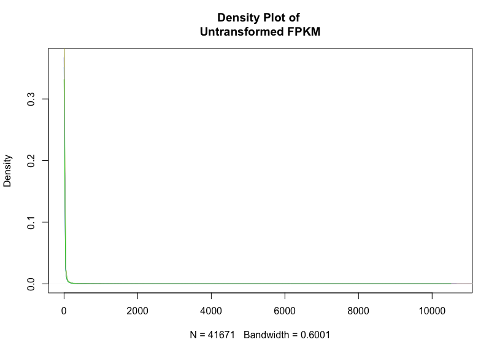
We can see virtually nothing except that there are many, many genes that are lowly expressed. The reason for the sharp peak 
is that the density plot automatically scales its x-axis from the lowest expressed to the highest expressed. Let's see what 
those values are:

<pre style="color: silver; background: black;">
min(fpkm)
<strong>0</strong>
max(fpkm)
<strong>13386.3</strong>
</pre>
Due to the scaling, we cannot truly see the distribution. However, what we <i>can</i> do is to transform the data such that the variance is not so staggering, allowing us to see better. There are a few rules for this, all of the data must be transformed in a consistent and reversible manner, after transformation no data may have a negative value, and all data with a value of 0 must also be 0 after transformation. The reason for the second and third rules is more epistemological. For us, if a gene has an FPKM of 0, then for that sample the gene is unexpressed. Should we transform the data and that particular gene's FPKM is now above 0, we are fundamentally changing the nature of that sample -- i.e., we are now saying it is expresesing a gene it actually is not! Additionally, there is no such thing as negative expression, so there is no physical reality where we will have an FPKM beneath 0. With these three rules, we see that taking the log of all our data will prevent negative values, be consistent and reversible, and scale down our variance. However, log(0) =  Inf! We have broken a cardinal rule (oddly enough, the fact that it is  Infinity is not a rule-breaker, but rather that it is <b>negative</b>  Infinity! Seeing this, we can simply add 1 to our data before log transforming, log(0+1) = 0. Now we have fulfilled all three rules.

<pre style="color: silver; background: black;">
fpkm = log2(fpkm + 1)
head(fpkm)
plot(density(fpkm[,1]),type="l",main="Density Comparison",col="red")
lines(density(fpkm[,2]),col="blue")
lines(density(fpkm[,3]),col="green")
lines(density(fpkm[,4]),col="red")
lines(density(fpkm[,5]),col="blue")
lines(density(fpkm[,6]),col="green")</pre>

We now we see an actual distribution. Let's see the difference in distribution between each individual part. To do this we are going to plot the density for each part, one by one, and watch for great changes.

</a><br>

Now we will generate a <a href="http://setosa.io/ev/principal-component-analysis/">PCA</a> plot. I strongly advise you read the PCA link before continuing if you are not familiar with Principal Component Analysis. It will not be explained in this tutorial.

Let's create a vector with our PCA point names
<pre style="color: silver; background: black;">
short_names = c("mu1","mu2","mu3","wt1","wt2","wt3")</pre>
We are going to be using the <a href="https://en.wikipedia.org/wiki/Pearson_correlation_coefficient">Pearson coefficient</a> for our PCA plot. You may think of the Pearson coefficient simply as a measure of similarity. If two datasets are very similar, they will have a Pearson coefficient approaching 1 (every data compared to itself has a Pearson coefficient of 1). If two datasets are very dissimilar, they will have a Pearson coefficient approaching 0 Let's calculate a vector containing the correlation coefficient:

<pre style="color: silver; background: black;">
r = cor(fpkm, use="pairwise.complete.obs", method="pearson")</pre>
Let's have a look at r:

<pre style="color: silver; background: black;">
r

<strong style="color:blue;">                           FPKM.athaliana_mutant_Rep1 FPKM.athaliana_mutant_Rep2 FPKM.athaliana_mutant_Rep3 FPKM.athaliana_wt_Rep1 FPKM.athaliana_wt_Rep2 FPKM.athaliana_wt_Rep3
FPKM.athaliana_mutant_Rep1                  1.0000000                  0.9689147                  0.9701448              0.9617423              0.9738848              0.9716859
FPKM.athaliana_mutant_Rep2                  0.9689147                  1.0000000                  0.9713023              0.9659690              0.9676161              0.9644472
FPKM.athaliana_mutant_Rep3                  0.9701448                  0.9713023                  1.0000000              0.9668139              0.9684712              0.9649888
FPKM.athaliana_wt_Rep1                      0.9617423                  0.9659690                  0.9668139              1.0000000              0.9606613              0.9631253
FPKM.athaliana_wt_Rep2                      0.9738848                  0.9676161                  0.9684712              0.9606613              1.0000000              0.9733014
FPKM.athaliana_wt_Rep3                      0.9716859                  0.9644472                  0.9649888              0.9631253              0.9733014              1.0000000</strong>

</pre>
Here we see each member of the diagonal is 1.000000. Of course we knew this already, as each member is 100% similar to itself! Then we have the similarity measures of each sample to each other sample.

Rather than calculate the similarity, it would be nicer to calculate the dissimilarity or distance between each sample. We know that if two samples are the same, their similarity measure is 1.000000. We also know that then their dissimilarity is 0%, or 0.000000. Here we see that if we subtract each element from 1, we get the dissimilarity matrix! Let's do it:

<pre style="color: silver; background: black;">
d = 1 - r
d
<strong style="color:blue;">
                           FPKM.athaliana_mutant_Rep1 FPKM.athaliana_mutant_Rep2 FPKM.athaliana_mutant_Rep3 FPKM.athaliana_wt_Rep1 FPKM.athaliana_wt_Rep2 FPKM.athaliana_wt_Rep3
FPKM.athaliana_mutant_Rep1                 0.00000000                 0.03108533                 0.02985520             0.03825768             0.02611516             0.02831408
FPKM.athaliana_mutant_Rep2                 0.03108533                 0.00000000                 0.02869768             0.03403101             0.03238395             0.03555277
FPKM.athaliana_mutant_Rep3                 0.02985520                 0.02869768                 0.00000000             0.03318614             0.03152878             0.03501125
FPKM.athaliana_wt_Rep1                     0.03825768                 0.03403101                 0.03318614             0.00000000             0.03933872             0.03687471
FPKM.athaliana_wt_Rep2                     0.02611516                 0.03238395                 0.03152878             0.03933872             0.00000000             0.02669858
FPKM.athaliana_wt_Rep3                     0.02831408                 0.03555277                 0.03501125             0.03687471             0.02669858             0.00000000</strong>
</pre>
R has a function which will perform the principal component analysis for us when provided with a dissimilarity matrix, cmdscale. Let's have a look at it:

<pre style="color: silver; background: black;">
help(cmdscale)</pre>

<pre style="color: silver; background: black;"><strong>Classical (Metric) Multidimensional Scaling</strong>

<strong style="color: grey;">Description</strong>

<em style="color: green;">Classical multidimensional scaling (MDS) of a data matrix. Also known as principal coordinates analysis (Gower, 1966).</em>

<strong style="color: grey;">Usage</strong>

cmdscale(d, k = 2, eig = FALSE, add = FALSE, x.ret = FALSE,
         list. = eig || add || x.ret)
<strong style=color: green;">Arguments</strong>

d	a distance structure such as that returned by dist or a full symmetric matrix containing the dissimilarities.
k	the maximum dimension of the space which the data are to be represented in; must be in {1, 2, …, n-1}.
eig	indicates whether eigenvalues should be returned.
add	logical indicating if an additive constant c* should be computed, and added to the non-diagonal dissimilarities such that the 
	modified dissimilarities are Euclidean.
x.ret	indicates whether the doubly centred symmetric distance matrix should be returned.
list.	logical indicating if a list should be returned or just the n * k matrix, see ‘Value:’.

<strong style="color:grey;">Details</strong>

Multidimensional scaling takes a set of dissimilarities and returns a set of points such that the distances between the points are approximately equal to the dissimilarities. (It is a major part of what ecologists call ‘ordination’.)

A set of Euclidean distances on n points can be represented exactly in at most n - 1 dimensions. cmdscale follows the analysis of Mardia (1978), and returns the best-fitting k-dimensional representation, where k may be less than the argument k.

The representation is only determined up to location (cmdscale takes the column means of the configuration to be at the origin), rotations and reflections. The configuration returned is given in principal-component axes, so the reflection chosen may differ between R platforms (see prcomp).

When add = TRUE, a minimal additive constant c* is computed such that the dissimilarities d[i,j] + c* are Euclidean and hence can be represented in n - 1 dimensions. Whereas S (Becker et al, 1988) computes this constant using an approximation suggested by Torgerson, R uses the analytical solution of Cailliez (1983), see also Cox and Cox (2001). Note that because of numerical errors the computed eigenvalues need not all be non-negative, and even theoretically the representation could be in fewer than n - 1 dimensions.</pre>

Let's perform our principal component analysis:

<pre style="color: silver; background: black;">pca = cmdscale(d, k=2)</pre>
We expect pca to have four rows, each row corresponding to a sample, and two columns, the first column representing our first coordinate axis and the second dimension representing our second coordinate axis. If we plot the first column against the second column, the distances between points is the dissimilarity between points.

<pre style="color: silver; background: black;">
pca

<strong style="color:blue;">                                   [,1]          [,2]
FPKM.athaliana_mutant_Rep1  0.010188699  0.0037862309
FPKM.athaliana_mutant_Rep2 -0.007391951  0.0125768089
FPKM.athaliana_mutant_Rep3 -0.006736291  0.0104882107
FPKM.athaliana_wt_Rep1     -0.021280708 -0.0133394678
FPKM.athaliana_wt_Rep2      0.013442569  0.0001839026
FPKM.athaliana_wt_Rep3      0.011777681 -0.0136956852</strong>

</pre>
For this next step it is assumed that you are familiar with plotting in R. If not you may look <a href="https://bio Informatics.uconn.edu/introduction-to-r/">here</a>.

<pre style="color: silver; background: black;">
plot.new()
par(mfrow=c(1,1))
##point colors
point_colors = c("red", "red","red","blue", "blue", "blue")
plot(pca[,1],pca[,2], xlab="", ylab="", main="PCA plot for all libraries", xlim=c(-0.025,0.02), ylim=c(-0.05,0.05),col=point_colors)
text(pca[,1],pca[,2],pos=2,short_names, col=c("red", "red","red","blue", "blue", "blue"))</pre>
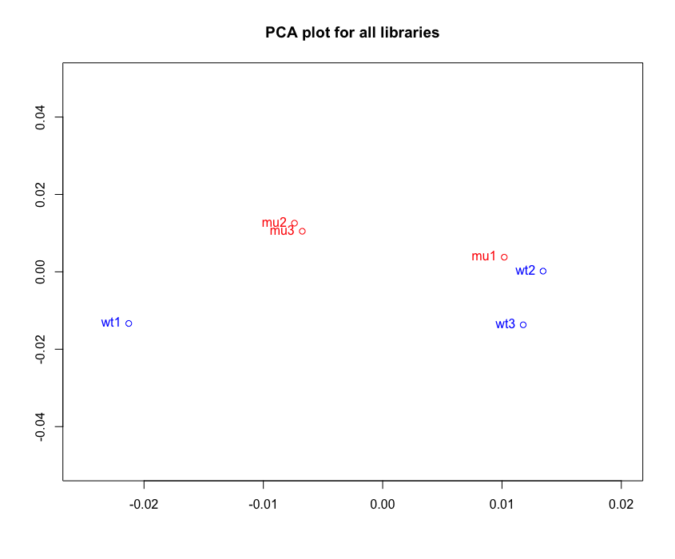


We should take advantage while we have this results_genes object and annotate the genes we have deemed significant (p-values below 0.01, every gene now in this object). To annotate the genes we will be using <a href="https://www.bioconductor.org/packages/devel/bioc/html/biomaRt.html">biomaRt</a> and biomartr. You can install these with the following code:
<pre style="color: silver; background: black;">
## try http:// if https:// URLs are not supported
source("https://bioconductor.org/biocLite.R")
biocLite("biomaRt")
install.packages("biomartr")</pre>

The first step in annotating our genes of interest is to choose our database. We do this using the "useMart" function of biomaRt:
<pre style="color: silver; background: black;">library(biomaRt)
library(biomartr)
??biomaRt::useMart

useMart {biomaRt}	R Documentation
Connects to the selected BioMart database and dataset

<strong>Description</strong>

<em>A first step in using the biomaRt package is to select a BioMart database and dataset to use. The useMart function enables one to connect to a specified BioMart database and dataset within this database. To know which BioMart databases are available see the listMarts function. To know which datasets are available within a BioMart database, first select the BioMart database using useMart and then use the listDatasets function on the selected BioMart, see listDatasets function.</em>

<strong>Usage</strong>

useMart(biomart, dataset, host="www.ensembl.org",
path="/biomart/martservice", port=80, archive=FALSE, ssl.verifypeer =
TRUE, ensemblRedirect = NULL, version, verbose = FALSE)
<strong>Arguments</strong>

biomart		BioMart database name you want to connect to. Possible database names can be retrieved with the functio listMarts
dataset		Dataset you want to use. To see the different datasets available within a biomaRt you can e.g. do: mart = 
		useMart('ensembl'), followed by listDatasets(mart).
host		Host to connect to. Defaults to www.ensembl.org
path		Path that should be pasted after to host to get access to the web service URL
port		port to connect to, will be pasted between host and path 
archive		Boolean to indicate if you want to access archived versions of BioMart databases. Note that this argument is now 
		deprecated and will be removed in the future. A better alternative is to leave archive = FALSE and to specify the url 
		of the archived BioMart you want to access. For Ensembl you can view the list of archives using listEnsemblArchives
ssl.verifypeer	Set SSL peer verification on or off. By default ssl.verifypeer is set to TRUE
ensemblRedirect	This argument has now been deprecated.
version		Use version name instead of biomart name to specify which BioMart you want to use
verbose		Give detailed output of what the method is doing while in use, for debugging</pre>

A quick google search will show that the genome we used, TAIR10, is the Ensembl format of the thale cress. We are going to want to use the gene dataset. Let's verify that it is there following the instructions provided:
<pre style="color: silver; background: black;">mart = useMart("ensembl")
 head(listDatasets(mart))
<strong>                       dataset                           description     version
1 abrachyrhynchus_gene_ensembl Pink-footed goose genes (ASM259213v1) ASM259213v1
2     acalliptera_gene_ensembl      Eastern happy genes (fAstCal1.2)  fAstCal1.2
3   acarolinensis_gene_ensembl        Anole lizard genes (AnoCar2.0)   AnoCar2.0
4    acitrinellus_gene_ensembl        Midas cichlid genes (Midas_v5)    Midas_v5
5        ahaastii_gene_ensembl    Great spotted kiwi genes (aptHaa1)     aptHaa1
6    amelanoleuca_gene_ensembl                 Panda genes (ailMel1)     ailMel1</strong></pre>

We want to scan this for the thale cress. But first, let's make sure we can scan it, period:

<pre style="color: silver; background: black;">listDatasets(mart)[grep("ahaastii",listDatasets(mart)[,1]),]
<strong>                dataset                        description version
5 ahaastii_gene_ensembl Great spotted kiwi genes (aptHaa1) aptHaa1</strong></pre>

We subset the listDatasets(mart) dataframe to include all rows which have the substring "amelanoleuca" in them. The return is row 2, which we can easily verify matches the head of the dataframe. Now let's try it with our species, "thaliana":
<pre style="color: silver; background: black;">listDatasets(mart)[grep("thaliana",listDatasets(mart)[,1]),]
<strong>[1] dataset     description version    
<0 rows> (or 0-length row.names)</strong></pre>

There is no match. The reason for this is that biomaRt defaults to animal model organisms! We need to access the plant database. Now let's try:
<pre style="color: silver; background: black;">listMarts(host="plants.ensembl.org")
<strong>            biomart                      version
1       plants_mart      Ensembl Plants Genes 43
2 plants_variations Ensembl Plants Variations 43</strong>

##if you are confused by the use of the listMarts function, read the useMart guide above!

mart = useMart("plants_mart", host="plants.ensembl.org")
head(listDatasets(mart))
<strong>              dataset                                      description         version
1  achinensis_eg_gene Actinidia chinensis Red5 genes (Red5_PS1_1.69.0) Red5_PS1_1.69.0
2    ahalleri_eg_gene              Arabidopsis halleri genes (Ahal2.2)         Ahal2.2
3     alyrata_eg_gene                 Arabidopsis lyrata genes (v.1.0)           v.1.0
4   atauschii_eg_gene               Aegilops tauschii genes (Aet v4.0)        Aet v4.0
5   athaliana_eg_gene              Arabidopsis thaliana genes (TAIR10)          TAIR10
6 atrichopoda_eg_gene             Amborella trichopoda genes (AMTR1.0)         AMTR1.0</strong>

##we see the thale cress as row 3! now we may choose our dataset:

thale_mart = useMart("plants_mart",host="plants.ensembl.org",dataset="athaliana_eg_gene")
head(thale_mart)
<strong>Error in x[seq_len(n)] : object of type 'S4' is not subsettable</strong></pre>

Our mart is in the <a href="http://adv-r.had.co.nz/S4.html">S4</a> class and not readable right now. We can process it by using the "getBM" function:
<pre style="color: silver; background: black;">??biomaRt::getBM

Retrieves  Information from the BioMart database

<strong>Description</strong>

<em>This function is the main biomaRt query function. Given a set of filters and corresponding values, it retrieves the user specified attributes from the BioMart database one is connected to.</em>

<strong>Usage</strong>

getBM(attributes, filters = "", values = "", mart, curl = NULL, 
checkFilters = TRUE, verbose = FALSE, uniqueRows = TRUE, bmHeader = FALSE,
quote = "\"")
<strong>Arguments</strong>

attributes	Attributes you want to retrieve. A possible list of attributes can be retrieved using the function listAttributes.
filters		Filters (one or more) that should be used in the query. A possible list of filters can be retrieved using the function 
		listFilters.
values		Values of the filter, e.g. vector of affy IDs. If multiple filters are specified then the argument should be a list of 
		vectors of which the position of each vector corresponds to the position of the filters in the filters argument.
mart		object of class Mart, created with the useMart function.
curl		An optional 'CURLHandle' object, that can be used to speed up getBM when used in a loop.
checkFilters	Sometimes attributes where a value needs to be specified, for example upstream\_flank with value 20 for obtaining 
		upstream sequence flank regions of length 20bp, are treated as filters in BioMarts. To enable such a query to work, one 
		must specify the attribute as a filter and set checkFilters = FALSE for the query to work.
verbose		When using biomaRt in webservice mode and setting verbose to TRUE, the XML query to the webservice will be printed.
uniqueRows	If the result of a query contains multiple identical rows, setting this argument to TRUE (default) will result in 
		deleting the duplicated rows in the query result at the server side.
bmHeader	Boolean to indicate if the result retrieved from the BioMart server should include the data headers or not, defaults to 
		FALSE. This should only be switched on if the default behavior results in errors, setting to on might still be able to 
		retrieve your data in that case
quote		Sometimes parsing of the results fails due to errors in the Ensembl data fields such as containing a quote, in such 
		cases you can try to change the value of quote to try to still parse the results.

<strong>Value</strong>

A data.frame. There is no implicit mapping between its rows and the function arguments (e.g. filters, values), therefore make sure to have the relevant identifier(s) returned by specifying them in attributes. See Examples.</pre>

Let's find out the attributes and filters by following the instructions in the vignette:
<pre style="color: silver; background: black;">dim(listAttributes(thale_mart))
<strong>[1] 1212    3</strong>

##1118 attributes is too many for us to look through. They are ordered somewhat in prevalence of use.

##let's look at the most commonly used attributes and see if they'll work for us

head(listAttributes(thale_mart))
<strong>                   name              description         page
1       ensembl_gene_id           Gene stable ID feature_page
2 ensembl_transcript_id     Transcript stable ID feature_page
3    ensembl_peptide_id        Protein stable ID feature_page
4       ensembl_exon_id           Exon stable ID feature_page
5           description         Gene description feature_page
6       chromosome_name Chromosome/scaffold name feature_page</strong>

##we don't know the chromosome name, so we can just take attributes 1,3, and 5

thale_data_frame = getBM(attributes=c("ensembl_gene_id","ensembl_peptide_id","description"),mart=thale_mart)
head(thale_data_frame)
<strong>
  ensembl_gene_id ensembl_peptide_id                              description
1       AT3G11415                                                            
2       AT1G31258                       other RNA [Source:TAIR;Acc:AT1G31258]
3       AT5G24735                       other RNA [Source:TAIR;Acc:AT5G24735]
4       AT2G45780                       other RNA [Source:TAIR;Acc:AT2G45780]
5       AT2G42425                    Unknown gene [Source:TAIR;Acc:AT2G42425]
6       AT4G01533                       other RNA [Source:TAIR;Acc:AT4G01533]</pre></strong>

The default descriptions are certainly underwhelming. Let's see if there are any other types of descriptions we can get:

<pre style="color: silver; background: black;">listAttributes(thale_mart)[grep("descr",listAttributes(thale_mart)[,1]),]
<strong>                           name                description         page
5                   description           Gene description feature_page
34       goslim_goa_description     GOSlim GOA Description feature_page
113  interpro_short_description Interpro Short Description feature_page
114        interpro_description       Interpro Description feature_page
151                 description           Gene description    structure
178                 description           Gene description     homologs
1133                description           Gene description          snp
1136         source_description Variant source description          snp
1174                description           Gene description    sequences</strong></pre>

Using the other descriptions will take much, much longer as the  Information is extracted from the appropriate databases via internet connection. For this tutorial we will be sticking with our un-impressive descriptions. However, you may choose the description best for you and your resesarch. Before we move on to annotating, let's have a look at the filters:

<pre style="color: silver; background: black;">head(listFilters(thale_mart))
<strong>                name                            description
1    chromosome_name               Chromosome/scaffold name
2              start                                  Start
3                end                                    End
4             strand                                 Strand
5 chromosomal_region e.g. 1:100:10000:-1, 1:100000:200000:1
6        with_chembl                      With ChEMBL ID(s)</strong></pre>

Should we only want to annotate genes from a specific chromosome or any other critera, we would use the "filter" argument in getBM to select only the subset of the genome we desire. We now have all of the pieces required for us to annotate our results. Let's have a look at our gene results object and our thale cress data frame one more time:
<pre style="color: silver; background: black;">head(thale_data_frame)
<strong>  ensembl_gene_id ensembl_peptide_id                              description
1       AT3G11415                                                            
2       AT1G31258                       other RNA [Source:TAIR;Acc:AT1G31258]
3       AT5G24735                       other RNA [Source:TAIR;Acc:AT5G24735]
4       AT2G45780                       other RNA [Source:TAIR;Acc:AT2G45780]
5       AT2G42425                    Unknown gene [Source:TAIR;Acc:AT2G42425]
6       AT4G01533                       other RNA [Source:TAIR;Acc:AT4G01533]</strong>

head(results_genes)
<strong>feature        id        fc        pval      qval
1    gene AT1G01050 0.8216286 0.038409878 0.9996177
2    gene AT1G01060 1.2906809 0.825960521 0.9996177
3    gene AT1G01080 0.8156244 0.276868361 0.9996177
4    gene AT1G01090 1.0838842 0.009539157 0.9996177
5    gene AT1G01100 0.9755726 0.687152148 0.9996177
6    gene AT1G01110 0.9522035 0.706397431 0.9996177</strong></pre>

Funny enough, we do not actually use a biomaRt function to annotate our genes! We can simply subset the thale cress data frame to consist of only rows whose ensemble_gene_id matches our results_genes id. Let's give it a try:
<pre style="color: silver; background: black;">annotated_genes = subset(thale_data_frame, ensembl_gene_id %in% results_genes$id)
head(annotated_genes)
<strong>    ensembl_gene_id ensembl_peptide_id                                                                                 description
15         AT3G48115                                                                          other RNA [Source:TAIR;Acc:AT3G48115]
151        AT4G04223                                                                          other RNA [Source:TAIR;Acc:AT4G04223]
588        AT2G46685                                                              MIR166/MIR166A; miRNA [Source:TAIR;Acc:AT2G46685]
2239       AT2G18917                                                                          other RNA [Source:TAIR;Acc:AT2G18917]
2380       AT4G38932                    Potential natural antisense gene, locus overlaps with AT4G38930 [Source:TAIR;Acc:AT4G38932]
5312       AT1G77590        AT1G77590.1    Long chain acyl-CoA synthetase 9, chloroplastic [Source:UniProtKB/Swiss-Prot;Acc:Q9CAP8]</strong>

##let's check our dimensions to ensure every gene was annotated

dim(results_genes)
<strong>[1] 117   5</strong>

dim(annotated_genes)
<strong>[1] 254   3</strong>

##our dimensions do not match! Let's investigate:

head(annotated_genes)
<strong> ensembl_gene_id ensembl_peptide_id                                                                                 description
15         AT3G48115                                                                          other RNA [Source:TAIR;Acc:AT3G48115]
151        AT4G04223                                                                          other RNA [Source:TAIR;Acc:AT4G04223]
588        AT2G46685                                                              MIR166/MIR166A; miRNA [Source:TAIR;Acc:AT2G46685]
2239       AT2G18917                                                                          other RNA [Source:TAIR;Acc:AT2G18917]
2380       AT4G38932                    Potential natural antisense gene, locus overlaps with AT4G38930 [Source:TAIR;Acc:AT4G38932]
5312       AT1G77590        AT1G77590.1    Long chain acyl-CoA synthetase 9, chloroplastic [Source:UniProtKB/Swiss-Prot;Acc:Q9CAP8]</strong>

tail(annotated_genes)
<strong>      ensembl_gene_id ensembl_peptide_id                                                                                                    description
52922       AT5G21930        AT5G21930.4                        Copper-transporting ATPase PAA2, chloroplastic [Source:UniProtKB/Swiss-Prot;Acc:B9DFX7]
52923       AT5G21930        AT5G21930.1                        Copper-transporting ATPase PAA2, chloroplastic [Source:UniProtKB/Swiss-Prot;Acc:B9DFX7]
53221       AT1G80290        AT1G80290.1                        Nucleotide-diphospho-sugar transferases superfamily protein [Source:TAIR;Acc:AT1G80290]
53222       AT1G80290        AT1G80290.2                        Nucleotide-diphospho-sugar transferases superfamily protein [Source:TAIR;Acc:AT1G80290]
53365       AT1G26670        AT1G26670.1                                                                 VTI1B [Source:UniProtKB/TrEMBL;Acc:A0A178W140]
53499       AT4G26490        AT4G26490.1 Late embryogenesis abundant (LEA) hydroxyproline-rich glycoprotein family [Source:UniProtKB/TrEMBL;Acc:Q56Y59]</strong></pre>

A-ha. We see the mismatch in dimension length is due to some genes having different isoforms and therefore different peptide ids. Because we matched our data frames by gene id, some of the genes we have extracted multiple peptides! Also, take notice of this:

<pre style="color: silver; background: black;">annotated_genes$ensembl_gene_id
<strong>  [1] "AT3G48115" "AT4G04223" "AT2G46685" "AT2G18917" "AT4G38932" "AT1G77590" "AT1G77590" "AT5G09480" "AT3G58760" "AT3G58760"
 [11] "AT3G58760" "AT3G58760" "AT3G58760" "AT3G58760" "AT5G09650" "AT4G36430" "AT5G23570" "AT5G23570" "AT5G23570" "AT5G23570"
 [21] "AT4G07990" "AT4G07990" "AT4G07990" "AT3G21720" "AT3G48240" "AT5G16660" "AT5G16660" "AT3G14070" "AT1G20680" "AT1G20680"
 [31] "AT5G21920" "AT5G21920" "AT3G20570" "AT3G56910" "AT2G19110" "AT2G19110" "AT2G19110" "AT5G44450" "AT5G44450" "AT3G24820"
 [41] "AT5G18550" "AT5G18550" "AT5G18550" "AT5G18550" "AT3G27830" "AT3G27830" "AT1G18680" "AT5G11980" "AT5G11980" "AT1G78200"
 [51] "AT1G78200" "AT1G78200" "AT1G78200" "AT1G78200" "AT1G63110" "AT1G63110" "AT1G63110" "AT4G14880" "AT4G14880" "AT4G14880"
 [61] "AT4G14880" "AT4G14880" "AT4G12230" "AT2G46680" "AT2G46680" "AT5G09995" "AT5G09995" "AT5G09995" "AT3G49810" "AT1G80560"
 [71] "AT3G58550" "AT4G24020" "AT4G24020" "AT5G49990" "AT5G49990" "AT5G49990" "AT5G49990" "AT2G43560" "AT2G43560" "AT3G53490"
 [81] "AT5G10450" "AT5G10450" "AT5G10450" "AT5G10450" "AT5G07020" "AT2G45950" "AT2G45950" "AT2G45950" "AT2G45950" "AT2G45950"
 [91] "AT5G22450" "AT5G22450" "AT5G22450" "AT2G43190" "AT2G43190" "AT2G43190" "AT2G43190" "AT2G43190" "AT1G26762" "AT5G48960"
[101] "AT1G11905" "AT1G11905" "AT2G37920" "AT1G77570" "AT5G07460" "AT5G44580" "AT3G62730" "AT3G62730" "AT5G65120" "AT5G65120"
[111] "AT4G01037" "AT1G06190" "AT1G06190" "AT1G06190" "AT1G06190" "AT1G06190" "AT3G08910" "AT1G15980" "AT1G78370" "AT1G58360"
[121] "AT1G01090" "AT1G63860" "AT1G63860" "AT1G63860" "AT1G63860" "AT1G63860" "AT1G63860" "AT4G23710" "AT3G18870" "AT5G21040"
[131] "AT5G21040" "AT5G21040" "AT4G31420" "AT4G31420" "AT3G05510" "AT3G05510" "AT5G38895" "AT5G38895" "AT5G38895" "AT4G30630"
[141] "AT4G30630" "AT1G02560" "AT2G21510" "AT2G21510" "AT2G21510" "AT2G21510" "AT2G21510" "AT5G56190" "AT5G56190" "AT5G56190"
[151] "AT5G56190" "AT5G56190" "AT5G56190" "AT5G56190" "AT1G67950" "AT1G67950" "AT1G67950" "AT1G67950" "AT1G05710" "AT1G05710"
[161] "AT1G05710" "AT1G05710" "AT1G05710" "AT1G05710" "AT1G05710" "AT1G05710" "AT1G05710" "AT1G05710" "AT1G05710" "AT1G05710"
[171] "AT1G05710" "AT1G05710" "AT1G73720" "AT5G62680" "AT1G07950" "AT1G07950" "AT1G16560" "AT1G16560" "AT1G16560" "AT1G16560"
[181] "AT1G16560" "AT1G16560" "AT1G16560" "AT1G16560" "AT1G16560" "AT5G65810" "AT2G18090" "AT2G18090" "AT2G26340" "AT2G26340"
[191] "AT1G75460" "AT1G31940" "AT4G19230" "AT4G19230" "AT4G11370" "AT4G19006" "AT4G19006" "AT2G21640" "AT1G14400" "AT1G14400"
[201] "AT1G12050" "AT5G52020" "AT3G52150" "AT3G52150" "AT2G36885" "AT2G36885" "AT2G40060" "AT1G51570" "AT1G07640" "AT1G07640"
[211] "AT1G07640" "AT5G24780" "AT5G24780" "AT1G02750" "AT1G02750" "AT1G78040" "AT1G78040" "AT1G78040" "AT2G35550" "AT2G35550"
[221] "AT2G35550" "AT2G35550" "AT3G61530" "AT3G61530" "AT1G70760" "AT3G19390" "AT5G42830" "AT1G23060" "AT1G23060" "AT1G23060"
[231] "AT1G23060" "AT1G23060" "AT3G56170" "AT2G18150" "AT4G24220" "AT4G24220" "AT4G09060" "AT4G09060" "AT4G26950" "AT4G26950"
[241] "AT2G37790" "AT5G17210" "AT5G17210" "AT5G43066" "AT1G10430" "AT1G10430" "AT5G21930" "AT5G21930" "AT5G21930" "AT5G21930"
[251] "AT1G80290" "AT1G80290" "AT1G26670" "AT4G26490"</strong>

write.csv(file="annotated_genes.csv",annotated_genes,row.names=F)</pre>


<h2 id="Seventh_Point_Header">Topological networking using cytoscape</h2>

<a href="https://github.com/miriamposner/cytoscape_tutorials">Cytoscape</a> is a desktop program which creates visual topological networks of data. To visualise our differentially regulated genes in a network on cytoscape we will follow the following steps

1. Load networkfile 
2. Lay the network out
3. Load Expression Data 
4. Examine node attributes

A detailed slides and tutorial is available at this <a href="https://cytoscape.org/cytoscape-tutorials/protocols/basic-data-visualization/#/">LINK</a>. Lets start cytoscape and the application will start with following screen.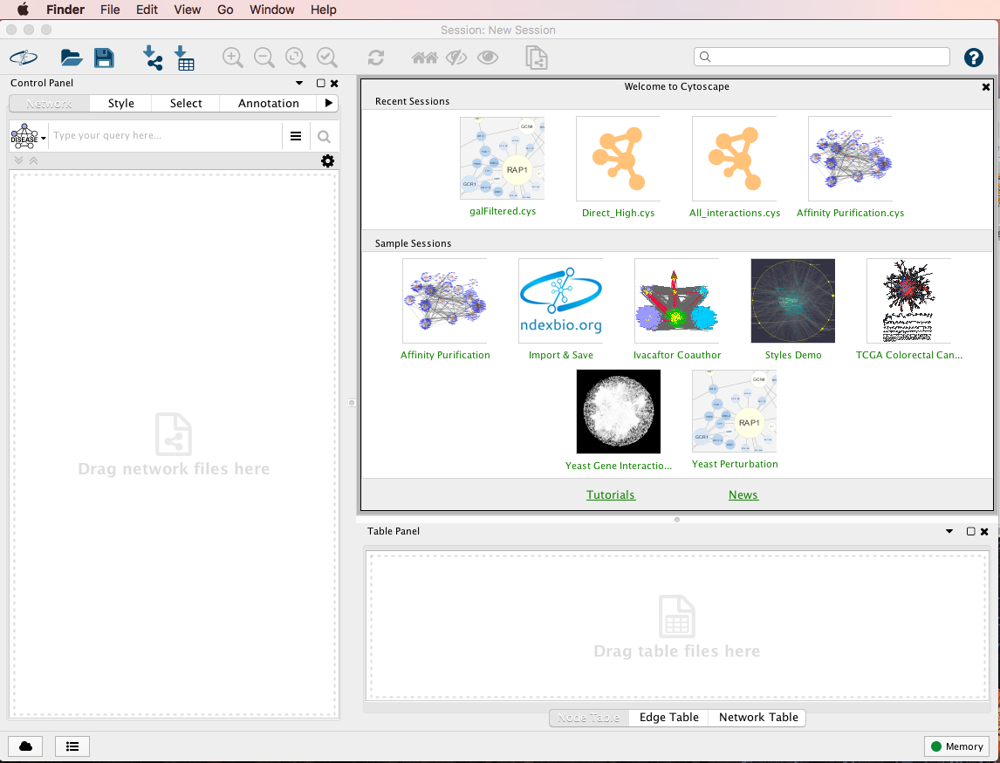   
Have a look around at different tabs and menu and familiarise yourself with it. A network can be loaded in cytoscape using the import function located under file menu as shown in the image below.  A network can be imported from a file (as we are going to do it), url or from public database.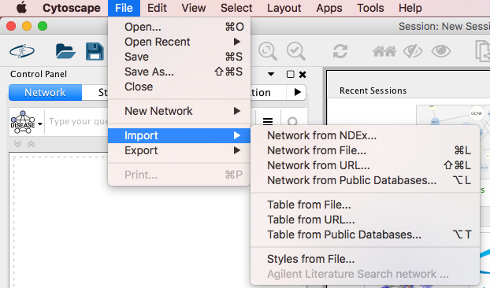  Import TAIR10 network file TairPP_refined.txt using file>import>Network from FIle option . The following table will be displayed .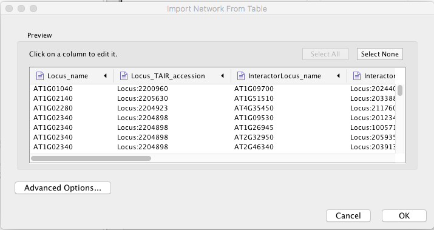   The table will display different columns of the network file. In this we have to specify which column represent protein A (source node) and which column represent protein B (target node) of A --> B type protein-protein intercation.
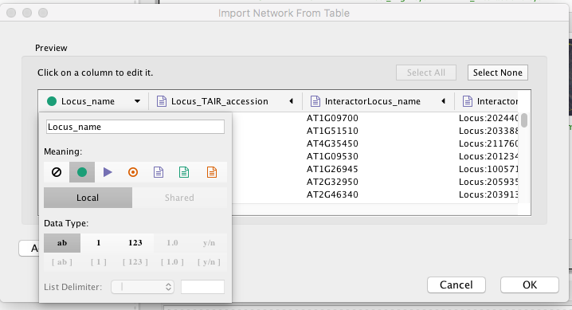 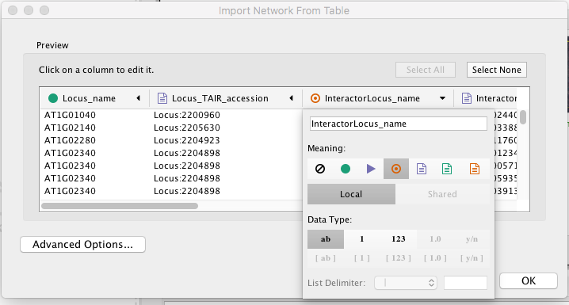 

Once imported different layouts can be tried listed under layout tab of cytoscape. Once you have chosen an appropriate layout and then import  differential expression data stored in csv or txt file using icon. 

Once the genes with differential expression is loaded, select the "Style tab and choose the "Fill Color".  Under fill color choose Column value to "fc" (fold change from csv file) and set Mapping type to "Continous mapping". You can double click on the color panel to set colors of your choice and can set boudries.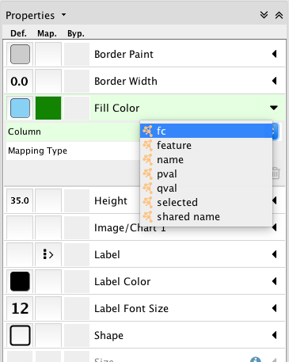 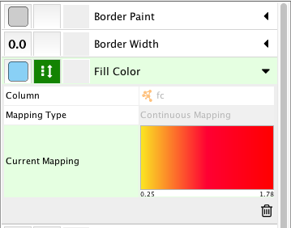

This will highlight the nodes based on the value of fc for protein present in differentially expressed genes and in the network list.


<h2 id="Eighth_Point_Header">Conclusion</h2>
You may find yourself wondering exactly what it is that we acccomplished by the end of this analysis. First, to recap we:

<pre style="color: silver; background: black;">Downloaded experimental data
Performed quality control on the experimental data
Aligned the experimental data to the reference genome, allowing us to determine which genes are active in each sample
Determined and quantified the gene isoforms present in each sample
Determined which gene isoforms had different general expression patterns between phenotypes
Created visual gene topologial networks
Extracted computational  Information about those networks</pre>

While our work may have seemed completed after creating the visualization, the picture itself is not of much use to other scientists! However, all of the csv files we created are. A scientist may have an interest in one particular gene we studied. With our differential expression results output she will be able to determine how the gene's behavior varied according to phenotype. Perhaps she wants to begin investigating if one gene codes for a transcription factor of another. She can consult our gene complete clusters file and see if the two genes belong to the same cluster (as the activation of one will activate the other!). She may be interested in the total behavior of one cluster in activating or suppressing another cluster. She can determine her base and target clusters by locating the genes in our complete clusters file, extract all genes from those clusters, and then explore how downstream each cluster's effect may be by utilizing the degree of relationship csv. Bio Informatics is a collaborative field. We are always dependent on the work of others to solve the questions about which we are the most passionate. Because of this, it is important to always dig deep in your own analysis, and to create as readable and handy data as you can. Not only because you do not want another scientist to be lost in your files, but they must be readable by a computer! Sometimes, it may have felt like we were going down the rabbit hole in this tutorial. However, the  Information we compiled is easy and immediately helpful for fellow scientists to use. Congratulations on finishing this tutorial successfully!

